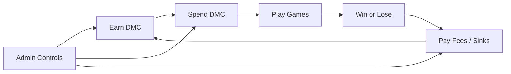
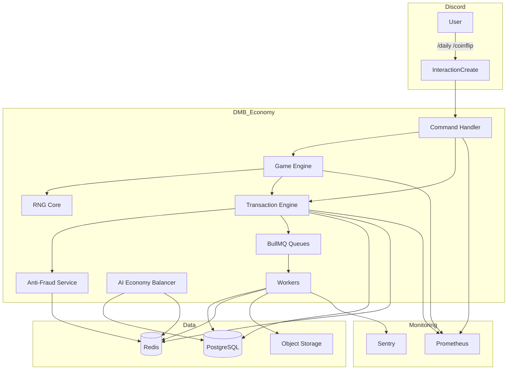
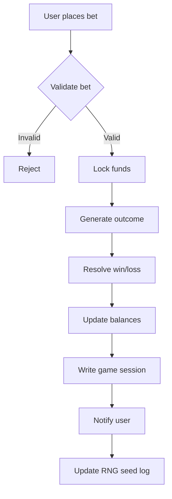
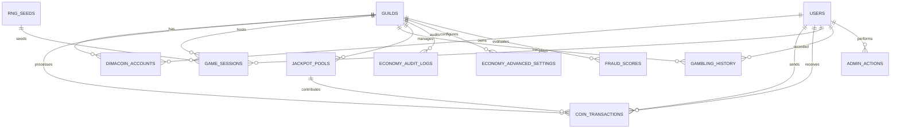
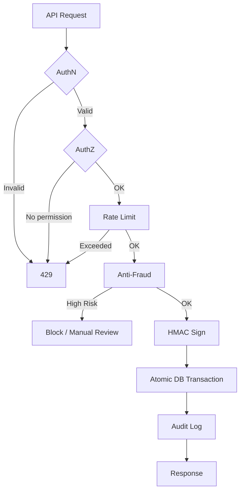

# DimaruBot (DMB) — DimaCoin Economy & Casino Platform Design

**Version:** 1.0.0  
**Status:** Draft / Design Phase  
**Last Updated:** 2026-06-25  

---

## Table of Contents

1. [Product Vision](#1-product-vision)
2. [Architecture](#2-architecture)
3. [Game Economy Design](#3-game-economy-design)
4. [Database Schema](#4-database-schema)
5. [API Design](#5-api-design)
6. [Security Model](#6-security-model)
7. [Admin Panel Design](#7-admin-panel-design)
8. [Risk Analysis](#8-risk-analysis)
9. [Scaling Plan](#9-scaling-plan)

---

## 1. Product Vision

### 1.1 Purpose
DimaCoin (DMC) transforms DimaruBot from a utility bot into a **Discord-based economy and game platform**. It introduces a persistent, secure, inflation-controlled virtual currency that powers minigames, casino systems, user-to-user transfers, premium upgrades, and cross-module interactions (tickets, moderation, AI, levels).

### 1.2 Target Audience
- Discord gamers and collectors.
- Server communities seeking engagement loops.
- Power users and whales seeking leaderboards and rare cosmetics.
- Server admins wanting economic moderation tools.

### 1.3 Core Loops


### 1.4 Unique Selling Proposition (USP)
**"Play, earn, and trade inside Discord — with bank-grade security and admin-controlled monetary policy."**

DimaCoin combines the engagement of OWO / Dank Memer with the security, scalability, and admin transparency of a production fintech platform.

### 1.5 Long-Term Goals
- Create a self-sustaining in-Discord economy across 100,000+ servers.
- Maintain inflation below 5% per month through dynamic sinks and AI balancing.
- Launch a player-to-player marketplace and NFT-backed cosmetic items (future).
- Generate 30% of total DMB revenue from DMC-related premium features.

### 1.6 Advantages / Disadvantages / Alternatives / Rationale

**Advantages**
- Increases daily active users through engagement loops.
- Creates monetization opportunities (premium, cosmetics, fees).
- Differentiates DMB from pure moderation bots.
- Encourages social interaction and competition.

**Disadvantages**
- Regulatory risk around gambling-like mechanics.
- Increased operational complexity and fraud exposure.
- Potential for player disputes and support load.

**Alternatives**
- Simple points system without currency (too shallow).
- External crypto token (legal/compliance nightmare).
- Purely cosmetic, no gambling (safer but lower engagement).

**Rationale:** A virtual, closed-loop DMC economy provides the best balance of engagement, monetization, and legal safety while remaining fully within Discord's Terms of Service.

---

## 2. Architecture

### 2.1 High-Level Architecture



### 2.2 Components

| Component | Responsibility |
|-----------|---------------|
| **Command Handler** | Routes `/daily`, `/work`, `/coinflip`, `/transfer`, `/casino`, etc. |
| **Game Engine** | Validates bets, resolves games, applies house edge, triggers payouts. |
| **RNG Core** | Cryptographically secure randomness with seed audit trail. |
| **Transaction Engine** | Atomic debit/credit, fee calculation, rollback, ledger writes. |
| **Anti-Fraud Service** | Multi-account, farming, bot abuse, anomaly detection. |
| **AI Economy Balancer** | Inflation tracking, supply control, dynamic reward adjustment. |
| **BullMQ Queues** | Async settlement, high-volume batching, audit log writes. |
| **Workers** | Process queues, update aggregates, generate reports. |

### 2.3 Advantages / Disadvantages / Alternatives / Rationale

**Advantages**
- Separation of concerns: game logic isolated from ledger logic.
- Queue-based processing ensures resilience under load.
- Redis + PostgreSQL hybrid balances speed and durability.

**Disadvantages**
- More moving parts than a simple in-memory economy.
- Requires careful handling of distributed transactions.

**Alternatives**
- Single-process SQLite economy (not scalable).
- Pure PostgreSQL without Redis (too slow for high-frequency games).
- Pure Redis without PostgreSQL (not durable enough).

**Rationale:** The hybrid architecture with a dedicated transaction engine provides the best combination of performance, durability, and auditability.

---

## 3. Game Economy Design

### 3.1 Currency: DimaCoin (DMC)
- **Symbol:** `DMC` or `🪙`
- **Type:** Integer (no decimals) for simplicity.
- **Scope:** Per-guild economy by default; optional global wallet for premium servers.
- **Supply:** Infinite minting controlled by faucets and sinks.

### 3.2 Coin Production (Faucets)
| Source | Base Reward | Cooldown | Notes |
|--------|-------------|----------|-------|
| **Daily** | 100–500 DMC | 24h | Streak bonus up to 7 days. |
| **Work** | 50–300 DMC | 4h | Random job outcome. |
| **Quests** | 100–1,000 DMC | Varies | Daily / weekly / event quests. |
| **Minigames** | 0–10,000 DMC | Per game | Skill / luck based. |
| **Events** | Custom | Event-driven | Admin or global events. |
| **Level Bonus** | +5% per level | Passive | Applied to faucet rewards. |
| **Premium** | +20%–50% | Passive | Subscription multiplier. |

### 3.3 Coin Sinks
| Sink | Mechanism |
|------|-----------|
| **Shop** | Cosmetic items, perks, rank cards. |
| **Upgrades** | Wallet capacity, work efficiency, daily multiplier. |
| **Gambling Losses** | House edge, loss to bot or other players. |
| **Fees** | Transfer fees (0%–5%), ticket fees. |
| **Premium Upgrade** | Pay DMC for server-wide premium features. |
| **Burn Events** | Admin or AI-driven coin burns. |

### 3.4 Transfer System (Critical)

#### 3.4.1 Transfer Flow
```mermaid
sequenceDiagram
    Sender->>+TE: transfer(to, amount)
    TE->>+AF: validate(sender, recipient, amount)
    AF-->>-TE: risk_score / limit
    TE->>+PG: BEGIN; SELECT wallet FOR UPDATE
    PG-->>-TE: balance
    TE->>TE: compute fee (0%–5%)
    TE->>PG: debit sender, credit recipient, fee sink
    TE->>PG: INSERT transaction + audit
    TE->>PG: COMMIT
    TE->>RD: update cache
    TE->>Sender: receipt
    TE->>Q: enqueue notifications
```

#### 3.4.2 Fee System
| Trust Tier | Requirement | Fee | Transfer Limit |
|------------|-------------|-----|----------------|
| **New** | Level < 3, no verified history | 5% | 1,000 DMC |
| **Standard** | Level 3+, 7+ days | 2% | 10,000 DMC |
| **Trusted** | Level 10+, 30+ days, no flags | 0% | 100,000 DMC |
| **Premium** | Premium guild or user | 0% | 1,000,000 DMC |

#### 3.4.3 Anti-Fraud Detection
- Velocity checks: max transfers per hour/day.
- Graph analysis: circular transfer patterns, alt accounts.
- Device/IP fingerprinting via Discord metadata (limited, not PII).
- Behavioral anomaly: sudden large bets/transfers.
- Cross-guild correlation: same user farming across servers.

### 3.5 Minigame & Casino System

#### 3.5.1 Game List
| Game | Mode | House Edge | Max Bet | Access |
|------|------|------------|---------|--------|
| **Coinflip** | 1v1 or vs Bot | 0% (vs Bot 2%) | Tier-based | Level 1+ |
| **Blackjack** | vs Dealer AI | 1.5% | Tier-based | Level 3+ |
| **Slots** | Solo | 5% | Tier-based | Level 1+ |
| **Roulette** | Solo | 2.7% (European) | Tier-based | Level 5+ |
| **Crash** | Solo | 1% | Tier-based | Level 10+ |
| **Dice Roll** | 1v1 or vs Bot | 0% (vs Bot 2%) | Tier-based | Level 1+ |
| **PvP Betting** | Matchmaking | 2% rake | High | Level 5+ |

#### 3.5.2 Game Engine Flow


#### 3.5.3 RNG Core
```ts
// packages/economy/src/rng.ts
import { randomBytes } from 'crypto';

export function secureRandom(min: number, max: number): number {
  const range = max - min + 1;
  const bytes = randomBytes(4);
  const randomValue = bytes.readUInt32LE(0);
  return min + (randomValue % range);
}

export function generateGameSession(seed: string, nonce: number): string {
  return createHmac('sha256', seed).update(String(nonce)).digest('hex');
}
```

#### 3.5.4 Risk Controls
- Daily loss limit per user.
- Game cooldowns (e.g., 5s between crash rounds).
- Level-based access to high-risk games.
- Fraud detection scoring during games.

### 3.6 AI Economy Balancer

#### 3.6.1 Metrics
| Metric | Description | Target |
|--------|-------------|--------|
| **M0 (Total Supply)** | Sum of all wallet + bank balances | Monitored |
| **M1 (Active Supply)** | Coins moved in last 7 days | >30% of M0 |
| **Inflation Rate** | Monthly supply growth | <5% |
| **Sink Ratio** | Daily sinks / daily faucets | >0.8 |
| **Casino PnL** | House profit/loss | Slightly positive |
| **Money Velocity** | Average transactions per active user | >5/week |

#### 3.6.2 Balancer Actions
| Condition | Action |
|-----------|--------|
| Inflation > 5% | Reduce faucet rewards, increase shop prices, burn fees. |
| Inflation < 1% | Increase rewards, add temporary events. |
| Casino losing money | Adjust house edge within allowed range. |
| M1 too low | Introduce quests and social rewards. |

### 3.7 Advantages / Disadvantages / Alternatives / Rationale

**Advantages**
- Strong engagement loop increases retention.
- Multiple monetization vectors.
- AI balancer keeps economy healthy automatically.
- Detailed audit trail reduces disputes.

**Disadvantages**
- Gambling mechanics carry legal and ethical risks.
- Complex fraud prevention required.
- Requires ongoing economic tuning.

**Alternatives**
- Fixed, non-adjustable economy (simpler but prone to inflation).
- External loot boxes (regulatory risk).
- No gambling, only cosmetic shop (lower engagement).

**Rationale:** A dynamic, AI-balanced economy with transparent sinks and strict anti-abuse controls provides the best player experience while keeping operational risk manageable.

## 4. Database Schema

### 4.1 DimaCoin Accounts
```sql
CREATE TABLE dimacoin_accounts (
  id              BIGSERIAL PRIMARY KEY,
  guild_id        BIGINT NOT NULL REFERENCES guilds(id),
  user_id         BIGINT NOT NULL REFERENCES users(id),
  wallet          BIGINT DEFAULT 0,
  bank            BIGINT DEFAULT 0,
  total_earned    BIGINT DEFAULT 0,
  total_spent     BIGINT DEFAULT 0,
  trust_score     INTEGER DEFAULT 0, -- 0-100
  level_multiplier DECIMAL(3,2) DEFAULT 1.00,
  is_frozen       BOOLEAN DEFAULT FALSE,
  frozen_reason   TEXT,
  frozen_at       TIMESTAMPTZ,
  frozen_by       BIGINT,
  last_daily_at   TIMESTAMPTZ,
  daily_streak    INTEGER DEFAULT 0,
  created_at      TIMESTAMPTZ DEFAULT NOW(),
  updated_at      TIMESTAMPTZ DEFAULT NOW(),
  UNIQUE(guild_id, user_id)
);
CREATE INDEX idx_dimacoin_accounts_guild ON dimacoin_accounts(guild_id);
CREATE INDEX idx_dimacoin_accounts_user ON dimacoin_accounts(user_id);
CREATE INDEX idx_dimacoin_accounts_trust ON dimacoin_accounts(guild_id, trust_score DESC);
```

### 4.2 Coin Transactions
```sql
CREATE TABLE coin_transactions (
  id              BIGSERIAL PRIMARY KEY,
  transaction_id  UUID DEFAULT gen_random_uuid() UNIQUE,
  guild_id        BIGINT NOT NULL REFERENCES guilds(id),
  sender_id       BIGINT REFERENCES users(id),
  recipient_id    BIGINT REFERENCES users(id),
  type            VARCHAR(40) NOT NULL, -- daily, work, transfer, game_win, game_loss, fee, admin_grant, admin_deduct, burn
  amount          BIGINT NOT NULL,
  fee             BIGINT DEFAULT 0,
  sender_balance_after BIGINT,
  recipient_balance_after BIGINT,
  security_hash   VARCHAR(64) NOT NULL,
  metadata        JSONB DEFAULT '{}',
  status          VARCHAR(20) DEFAULT 'completed', -- pending, completed, rolled_back
  rolled_back_at  TIMESTAMPTZ,
  rollback_reason TEXT,
  created_at      TIMESTAMPTZ DEFAULT NOW()
);
CREATE INDEX idx_coin_transactions_guild ON coin_transactions(guild_id, created_at DESC);
CREATE INDEX idx_coin_transactions_user ON coin_transactions(guild_id, sender_id, created_at DESC);
CREATE INDEX idx_coin_transactions_type ON coin_transactions(type);
CREATE INDEX idx_coin_transactions_status ON coin_transactions(status);
CREATE INDEX idx_coin_transactions_hash ON coin_transactions(security_hash);
```

### 4.3 Game Sessions
```sql
CREATE TABLE game_sessions (
  id              BIGSERIAL PRIMARY KEY,
  session_id      UUID DEFAULT gen_random_uuid() UNIQUE,
  guild_id        BIGINT NOT NULL REFERENCES guilds(id),
  user_id         BIGINT NOT NULL REFERENCES users(id),
  game_type       VARCHAR(40) NOT NULL, -- coinflip, blackjack, slots, roulette, crash, dice, pvp_bet
  mode            VARCHAR(20) NOT NULL, -- solo, pvp, vs_bot
  opponent_id     BIGINT REFERENCES users(id),
  bet_amount      BIGINT NOT NULL,
  outcome         VARCHAR(20) NOT NULL, -- win, loss, draw, pending
  payout          BIGINT DEFAULT 0,
  house_edge      DECIMAL(5,2) NOT NULL,
  rng_seed_id     BIGINT NOT NULL REFERENCES rng_seeds(id),
  result_data     JSONB NOT NULL,
  status          VARCHAR(20) DEFAULT 'active',
  resolved_at     TIMESTAMPTZ,
  created_at      TIMESTAMPTZ DEFAULT NOW()
);
CREATE INDEX idx_game_sessions_guild ON game_sessions(guild_id, created_at DESC);
CREATE INDEX idx_game_sessions_user ON game_sessions(guild_id, user_id, created_at DESC);
CREATE INDEX idx_game_sessions_game ON game_sessions(guild_id, game_type, created_at DESC);
CREATE INDEX idx_game_sessions_status ON game_sessions(status);
```

### 4.4 Gambling History
```sql
CREATE TABLE gambling_history (
  id              BIGSERIAL PRIMARY KEY,
  guild_id        BIGINT NOT NULL REFERENCES guilds(id),
  user_id         BIGINT NOT NULL REFERENCES users(id),
  game_type       VARCHAR(40) NOT NULL,
  total_bets      BIGINT DEFAULT 0,
  total_wins      BIGINT DEFAULT 0,
  total_losses    BIGINT DEFAULT 0,
  net_profit      BIGINT DEFAULT 0,
  daily_loss      BIGINT DEFAULT 0,
  daily_loss_reset_at TIMESTAMPTZ,
  last_game_at    TIMESTAMPTZ,
  updated_at      TIMESTAMPTZ DEFAULT NOW()
);
CREATE INDEX idx_gambling_history_user ON gambling_history(guild_id, user_id);
CREATE INDEX idx_gambling_history_game ON gambling_history(guild_id, game_type);
```

### 4.5 Economy Audit Logs
```sql
CREATE TABLE economy_audit_logs (
  id              BIGSERIAL PRIMARY KEY,
  guild_id        BIGINT REFERENCES guilds(id),
  user_id         BIGINT REFERENCES users(id),
  action          VARCHAR(60) NOT NULL,
  entity          VARCHAR(40) NOT NULL,
  entity_id       BIGINT,
  changes         JSONB NOT NULL,
  ip_address      INET,
  user_agent      TEXT,
  admin_id        BIGINT REFERENCES users(id),
  is_immutable    BOOLEAN DEFAULT TRUE,
  created_at      TIMESTAMPTZ DEFAULT NOW()
);
CREATE INDEX idx_economy_audit_guild ON economy_audit_logs(guild_id, created_at DESC);
CREATE INDEX idx_economy_audit_action ON economy_audit_logs(action, entity);
CREATE INDEX idx_economy_audit_admin ON economy_audit_logs(admin_id);
```

### 4.6 Admin Actions
```sql
CREATE TABLE admin_actions (
  id              BIGSERIAL PRIMARY KEY,
  guild_id        BIGINT REFERENCES guilds(id),
  admin_id        BIGINT NOT NULL REFERENCES users(id),
  target_user_id  BIGINT REFERENCES users(id),
  action_type     VARCHAR(40) NOT NULL, -- grant, deduct, freeze, unfreeze, reset_economy, set_balance
  amount          BIGINT,
  reason          TEXT NOT NULL,
  metadata        JSONB DEFAULT '{}',
  ip_address      INET,
  user_agent      TEXT,
  is_immutable    BOOLEAN DEFAULT TRUE,
  created_at      TIMESTAMPTZ DEFAULT NOW()
);
CREATE INDEX idx_admin_actions_admin ON admin_actions(admin_id, created_at DESC);
CREATE INDEX idx_admin_actions_guild ON admin_actions(guild_id, created_at DESC);
CREATE INDEX idx_admin_actions_target ON admin_actions(target_user_id);
```

### 4.7 RNG Seeds
```sql
CREATE TABLE rng_seeds (
  id              BIGSERIAL PRIMARY KEY,
  seed            VARCHAR(128) NOT NULL,
  seed_hash       VARCHAR(64) NOT NULL,
  nonce           BIGINT DEFAULT 0,
  algorithm       VARCHAR(20) DEFAULT 'hmac-sha256',
  generated_at    TIMESTAMPTZ DEFAULT NOW(),
  rotated_at      TIMESTAMPTZ,
  is_active       BOOLEAN DEFAULT TRUE
);
CREATE INDEX idx_rng_seeds_active ON rng_seeds(is_active, generated_at DESC);
CREATE INDEX idx_rng_seeds_hash ON rng_seeds(seed_hash);
```

### 4.8 Jackpot Pools
```sql
CREATE TABLE jackpot_pools (
  id              BIGSERIAL PRIMARY KEY,
  guild_id        BIGINT NOT NULL REFERENCES guilds(id),
  name            VARCHAR(100) NOT NULL,
  pool_type       VARCHAR(40) NOT NULL, -- slots, global, event
  balance         BIGINT DEFAULT 0,
  contribution_rate DECIMAL(5,2) DEFAULT 0.01,
  last_winner_id  BIGINT REFERENCES users(id),
  last_won_at     TIMESTAMPTZ,
  created_at      TIMESTAMPTZ DEFAULT NOW()
);
CREATE INDEX idx_jackpot_pools_guild ON jackpot_pools(guild_id, pool_type);
```

### 4.9 Fraud Scores
```sql
CREATE TABLE fraud_scores (
  id              BIGSERIAL PRIMARY KEY,
  guild_id        BIGINT NOT NULL REFERENCES guilds(id),
  user_id         BIGINT NOT NULL REFERENCES users(id),
  score           INTEGER DEFAULT 0,
  flags           TEXT[] DEFAULT '{}',
  last_evaluated_at TIMESTAMPTZ,
  created_at      TIMESTAMPTZ DEFAULT NOW(),
  updated_at      TIMESTAMPTZ DEFAULT NOW(),
  UNIQUE(guild_id, user_id)
);
CREATE INDEX idx_fraud_scores_user ON fraud_scores(guild_id, user_id);
CREATE INDEX idx_fraud_scores_high ON fraud_scores(guild_id, score DESC);
```

### 4.10 Economy Settings
```sql
CREATE TABLE economy_advanced_settings (
  guild_id                BIGINT PRIMARY KEY REFERENCES guilds(id),
  currency_name           VARCHAR(32) DEFAULT 'DimaCoin',
  currency_symbol         VARCHAR(8) DEFAULT '🪙',
  daily_base              INTEGER DEFAULT 100,
  daily_streak_bonus      INTEGER DEFAULT 10,
  transfer_fee_min        DECIMAL(5,2) DEFAULT 0.00,
  transfer_fee_max        DECIMAL(5,2) DEFAULT 0.05,
  transfer_fee_trusted    DECIMAL(5,2) DEFAULT 0.00,
  transfer_limit_new        BIGINT DEFAULT 1000,
  transfer_limit_standard   BIGINT DEFAULT 10000,
  transfer_limit_trusted    BIGINT DEFAULT 100000,
  transfer_limit_premium    BIGINT DEFAULT 1000000,
  work_cooldown_minutes     INTEGER DEFAULT 240,
  game_loss_limit_daily     BIGINT DEFAULT 5000,
  game_loss_limit_weekly    BIGINT DEFAULT 25000,
  house_edge_default        DECIMAL(5,2) DEFAULT 0.02,
  inflation_target_monthly  DECIMAL(5,2) DEFAULT 0.05,
  ai_balancer_enabled       BOOLEAN DEFAULT TRUE,
  casino_enabled            BOOLEAN DEFAULT TRUE,
  transfers_enabled         BOOLEAN DEFAULT TRUE,
  updated_at                TIMESTAMPTZ DEFAULT NOW()
);
```

### 4.11 ER Diagram



---

## 5. API Design

### 5.1 API Design
- **Base:** `/api/v1/economy`
- **Auth:** Discord OAuth2 + JWT + admin 2FA for god-mode endpoints.
- **Rate limiting:** Redis per user and per guild.

### 5.2 Endpoint Examples
```
GET    /api/v1/economy/guilds/:guildId/balance
GET    /api/v1/economy/guilds/:guildId/accounts/:userId
GET    /api/v1/economy/guilds/:guildId/accounts/:userId/transactions
POST   /api/v1/economy/guilds/:guildId/transfer
POST   /api/v1/economy/guilds/:guildId/daily
POST   /api/v1/economy/guilds/:guildId/work
POST   /api/v1/economy/guilds/:guildId/games/:gameType/bet
GET    /api/v1/economy/guilds/:guildId/games/:sessionId
GET    /api/v1/economy/guilds/:guildId/leaderboard
GET    /api/v1/economy/guilds/:guildId/games/history
GET    /api/v1/economy/guilds/:guildId/economy-health
GET    /api/v1/economy/guilds/:guildId/shop
POST   /api/v1/economy/guilds/:guildId/shop/buy

// Admin endpoints (god mode)
GET    /api/v1/admin/economy/accounts
POST   /api/v1/admin/economy/accounts/:userId/grant
POST   /api/v1/admin/economy/accounts/:userId/deduct
POST   /api/v1/admin/economy/accounts/:userId/freeze
POST   /api/v1/admin/economy/accounts/:userId/unfreeze
POST   /api/v1/admin/economy/guilds/:guildId/reset
GET    /api/v1/admin/economy/audit-logs
GET    /api/v1/admin/economy/fraud-scores
POST   /api/v1/admin/economy/guilds/:guildId/settings
POST   /api/v1/admin/economy/guilds/:guildId/balancer/adjust
```

### 5.3 Transfer Request Example
```json
POST /api/v1/economy/guilds/:guildId/transfer
{
  "recipientId": "123456789012345678",
  "amount": 5000,
  "note": "Thanks for the help!"
}

Response:
{
  "transactionId": "550e8400-e29b-41d4-a716-446655440000",
  "senderId": "...",
  "recipientId": "...",
  "amount": 5000,
  "fee": 100,
  "senderBalanceAfter": 4900,
  "recipientBalanceAfter": 10500,
  "securityHash": "sha256:...",
  "createdAt": "2026-06-25T18:00:00Z"
}
```

### 5.4 Admin Grant Example
```json
POST /api/v1/admin/economy/accounts/:userId/grant
Headers: X-Admin-2FA-Code: 123456
{
  "guildId": "...",
  "amount": 100000,
  "reason": "Event reward distribution"
}

Response:
{
  "adminActionId": 42,
  "transactionId": "...",
  "userId": "...",
  "amount": 100000,
  "balanceAfter": 105000,
  "auditLogId": 99
}
```

---

## 6. Security Model

### 6.1 Security Architecture


### 6.2 Transaction Integrity
Every transaction is signed with an HMAC using a server-side secret.

```ts
import { createHmac } from 'crypto';

export function signTransaction(tx: TransactionInput): string {
  const payload = `${tx.guildId}:${tx.senderId}:${tx.recipientId}:${tx.amount}:${tx.type}:${tx.createdAt}`;
  return createHmac('sha256', process.env.ECONOMY_HMAC_SECRET)
    .update(payload)
    .digest('hex');
}

export function verifyTransaction(tx: TransactionRecord): boolean {
  const expected = signTransaction(tx);
  return timingSafeEqual(Buffer.from(tx.securityHash), Buffer.from(expected));
}
```

### 6.3 Replay Attack Protection
- `transaction_id` UUID is unique.
- Redis `dmb:tx:id:<uuid>` set with `NX` for idempotency.
- Sender nonce stored per transaction window.

### 6.4 Rate Limiting
```ts
const rateKeys = {
  transfer: (g: string, u: string) => `dmb:rate:transfer:${g}:${u}`,
  game: (g: string, u: string, game: string) => `dmb:rate:game:${g}:${u}:${game}`,
  daily: (g: string, u: string) => `dmb:rate:daily:${g}:${u}`,
};

// 10 transfers per minute per user
await redis.incr(rateKeys.transfer(guildId, userId));
await redis.expire(rateKeys.transfer(guildId, userId), 60);
```

### 6.5 Anti-Fraud Rules
| Rule | Trigger | Action |
|------|---------|--------|
| **Circular transfers** | A -> B -> A within 1 hour | Flag, hold funds, notify admin. |
| **Rapid farming** | 50+ daily claims from same IP range | Freeze accounts, require review. |
| **Bot abuse** | Inhuman reaction times / 24/7 activity | Score increase, CAPTCHA challenge. |
| **High-risk transfer** | Amount > 5x normal daily volume | Require confirmation, delay settlement. |
| **Multi-account** | Same creator/IP/account age pattern | Mark for investigation. |

### 6.6 Advantages / Disadvantages / Alternatives / Rationale

**Advantages**
- HMAC ensures transaction integrity.
- Redis-based rate limits are fast and distributed.
- Atomic DB transactions prevent double-spend.

**Disadvantages**
- HMAC secret management is critical.
- Complex fraud rules can false-positive.

**Alternatives**
- Blockchain (overkill, slow, regulatory issues).
- Optimistic locking only (not enough for high-frequency games).
- No signing (insecure, non-auditable).

**Rationale:** A hybrid model with HMAC signatures, Redis idempotency, and PostgreSQL ACID transactions provides the strongest security with acceptable performance.

---

## 7. Admin Panel Design

### 7.1 God Mode Access
- **Allowed Discord User ID:** `1228369441683931149`
- Access is enforced at API middleware layer, not just UI.
- Requires Discord OAuth2 + JWT + TOTP 2FA.
- Optional IP whitelist.

### 7.2 Admin Middleware
```ts
export async function requireGodMode(req, reply) {
  const userId = req.user.sub;
  const godModeIds = process.env.GOD_MODE_USER_IDS.split(',');
  if (!godModeIds.includes(userId)) {
    return reply.status(403).send({ error: 'GodModeRequired' });
  }
  const tfa = await verifyTOTP(req.headers['x-admin-2fa-code'], userId);
  if (!tfa.valid) {
    return reply.status(401).send({ error: 'TOTPRequired' });
  }
  await logAdminAction(req, 'panel_access');
}
```

### 7.3 Admin Panel Pages
| Page | Capabilities |
|------|--------------|
| **Economy Overview** | Total supply, active users, inflation, velocity, casino PnL. |
| **User Accounts** | Search, view balances, transaction history, freeze/unfreeze. |
| **Balance Control** | Grant / deduct DMC with reason and audit trail. |
| **Transaction Override** | Force refund, rollback, or manual correction. |
| **Game Control** | Toggle games, adjust house edge, view live sessions. |
| **Fraud Dashboard** | High fraud scores, flags, investigation queue. |
| **Audit Logs** | Immutable, full-access audit trail. |
| **Server Reset** | Reset economy for a specific guild (with backup). |
| **Global Market** | Shop prices, jackpot settings, economy balancer parameters. |

### 7.4 Wireframe
```
┌─────────────────────────────────────────────┐
│  God Mode Admin Panel                       │
│  [2FA Verified] [User: 1228369441683931149] │
├─────────────────────────────────────────────┤
│  Sidebar │  Main Content                    │
│  Overview│  KPI Cards + Charts               │
│  Accounts│  Search / Grant / Deduct / Freeze │
│  Games   │  Live sessions + settings         │
│  Fraud   │  Risk queue + actions               │
│  Audit   │  Immutable log feed                 │
│  Reset   │  Guild economy reset + backup       │
└─────────────────────────────────────────────┘
```

### 7.5 Immutable Audit Logs
Admin actions are written to `economy_audit_logs` and `admin_actions` tables with:
- `is_immutable = TRUE`
- Write-once table with `BEFORE UPDATE` trigger preventing modification.
- Exported to append-only object storage daily.

```sql
CREATE OR REPLACE FUNCTION prevent_audit_update()
RETURNS TRIGGER AS $$
BEGIN
  IF OLD.is_immutable THEN
    RAISE EXCEPTION 'Immutable audit log cannot be modified';
  END IF;
  RETURN NEW;
END;
$$ LANGUAGE plpgsql;

CREATE TRIGGER trg_prevent_audit_update
BEFORE UPDATE ON economy_audit_logs
FOR EACH ROW EXECUTE FUNCTION prevent_audit_update();
```

### 7.6 Advantages / Disadvantages / Alternatives / Rationale

**Advantages**
- Centralized control for economy health.
- Immutable audit logs prevent cover-ups.
- 2FA and IP whitelist protect against account takeover.

**Disadvantages**
- Centralized power creates trust dependency.
- Panel becomes a high-value target.

**Alternatives**
- No admin override (slow to respond to exploits).
- DAO-style governance (too complex for MVP).
- In-bot commands only (less auditable and usable).

**Rationale:** A tightly controlled, audited, 2FA-protected admin panel is the most practical way to manage a live economy.

---

## 8. Risk Analysis

### 8.1 Technical Risks
| Risk | Impact | Mitigation |
|------|--------|------------|
| Double-spend | Critical | Atomic transactions, row-level locking, Redis idempotency. |
| Race conditions | High | `SELECT FOR UPDATE`, optimistic locking, queue serialization. |
| Database deadlock | High | Consistent lock ordering, short transactions, retries. |
| RNG manipulation | High | HMAC-seeded, rotated seeds, public provability. |
| Queue backlog | Medium | Horizontal workers, priority queues, dead-letter. |
| AI balancer errors | Medium | Human override, guardrails, alerts. |

### 8.2 Security Risks
| Risk | Impact | Mitigation |
|------|--------|------------|
| Admin panel takeover | Critical | 2FA, IP whitelist, immutable logs, least privilege. |
| HMAC secret leak | Critical | Secret manager, rotation, no logging. |
| Fraud / wash trading | High | Fraud scoring, transfer limits, velocity checks. |
| Bot farming | High | CAPTCHA, behavioral analysis, account age checks. |
| Exploit abuse | High | Rate limits, loss limits, admin kill switches. |

### 8.3 Legal / Compliance Risks
| Risk | Impact | Mitigation |
|------|--------|------------|
| Gambling regulation | High | No real-money exchange; cosmetic-only rewards; age-gate disclaimers. |
| Loot box regulation | Medium | Transparent odds, no real-money purchase for game currency. |
| Tax / reporting | Medium | Terms of Service clarify virtual currency has no real-world value. |

### 8.4 Economic Risks
| Risk | Impact | Mitigation |
|------|--------|------------|
| Hyperinflation | High | AI balancer, sinks, fees, burns, admin controls. |
| Deflation | Medium | Temporary faucets, events, reward boosts. |
| Casino bankroll drain | Medium | House edge, max bet limits, loss limits. |
| Wealth inequality | Medium | Progressive faucets, quests for new players. |

### 8.5 Advantages / Disadvantages / Alternatives / Rationale

**Advantages**
- Early risk identification allows proactive mitigation.
- Immutable audit logs aid dispute resolution.
- AI balancer reduces manual intervention.

**Disadvantages**
- Risk controls add latency and complexity.
- Some controls may frustrate legitimate users.

**Alternatives**
- Minimal security (faster but unsafe).
- Full KYC (overkill and privacy-invasive).
- No gambling mechanics (safer but less engaging).

**Rationale:** A layered risk model with technical, security, legal, and economic controls is essential for a production-grade virtual economy.

---

## 9. Scaling Plan

### 9.1 Scaling Strategy
| Scale | Guilds | Architecture |
|-------|--------|--------------|
| **Phase 1** | 1–1,000 | Single process, Docker Compose, PostgreSQL + Redis. |
| **Phase 2** | 1,000–10,000 | Sharded bot, separate workers, PgBouncer, read replicas. |
| **Phase 3** | 10,000–100,000 | Kubernetes, Redis Cluster, dedicated game workers, multi-region. |
| **Phase 4** | 100,000+ | Microservices split: economy, casino, fraud, AI balancer; global economy option. |

### 9.2 Database Scaling
- **Partitioning:** Partition `coin_transactions` and `game_sessions` by `guild_id` and `created_at`.
- **Read replicas:** Use replicas for analytics, leaderboards, and audit queries.
- **Connection pooling:** PgBouncer with transaction pooling.
- **Archiving:** Move cold transactions (>90 days) to object storage for compliance.

### 9.3 Redis Scaling
- **Redis Cluster** for cache and rate limits across shards.
- **Separate Redis** for queues to prevent queue pressure affecting cache.
- **Persistence:** AOF + RDB for durability on critical queues.

### 9.4 Queue Scaling
- Separate queues per game type and transaction type.
- Worker autoscaling based on queue depth.
- Batch inserts for high-frequency transaction logs.

### 9.5 Game Engine Scaling
- Stateless workers allow horizontal scaling.
- RNG seeds centralized and rotated via PostgreSQL.
- Matchmaking service for PvP betting (future).

### 9.6 Advantages / Disadvantages / Alternatives / Rationale

**Advantages**
- Phased approach avoids over-engineering early.
- Stateless design simplifies scaling.
- Partitioning and archiving control storage costs.

**Disadvantages**
- Microservices add operational complexity.
- Global economy is harder to scale than per-guild.

**Alternatives**
- Single database forever (will hit limits).
- Blockchain-based economy (slower, more regulatory risk).
- No horizontal scaling (not viable for 100k+ servers).

**Rationale:** A per-guild economy with optional global features, combined with phased sharding and microservices, is the most scalable and legally safe approach.

---

## 10. Final Summary

DimaCoin is designed as a **secure, scalable, AI-balanced Discord economy and casino platform** that integrates tightly with the broader DimaruBot ecosystem.

### Key Decisions
| Decision | Choice | Rationale |
|----------|--------|-----------|
| Currency | DimaCoin (DMC) | Closed-loop, low legal risk, easy to manage. |
| Storage | PostgreSQL + Redis | Durability + speed. |
| Transactions | Atomic with HMAC signing | Prevents double-spend and tampering. |
| Games | In-house engine with provable RNG | Transparent and auditable. |
| Fraud | Redis + AI scoring | Real-time detection. |
| Admin | God-mode panel with 2FA | Necessary control with strong safeguards. |
| Scaling | Per-guild economy + phased microservices | Balances complexity and scalability. |

### Success Criteria
- **Integrity:** Zero successful double-spend or rollback exploit.
- **Performance:** P95 game resolution < 100ms.
- **Economy Health:** Monthly inflation < 5%.
- **Security:** Zero admin panel breaches; immutable audit logs.
- **Scale:** Support 100,000+ servers with < 1s API response.

---

**End of Document.**

