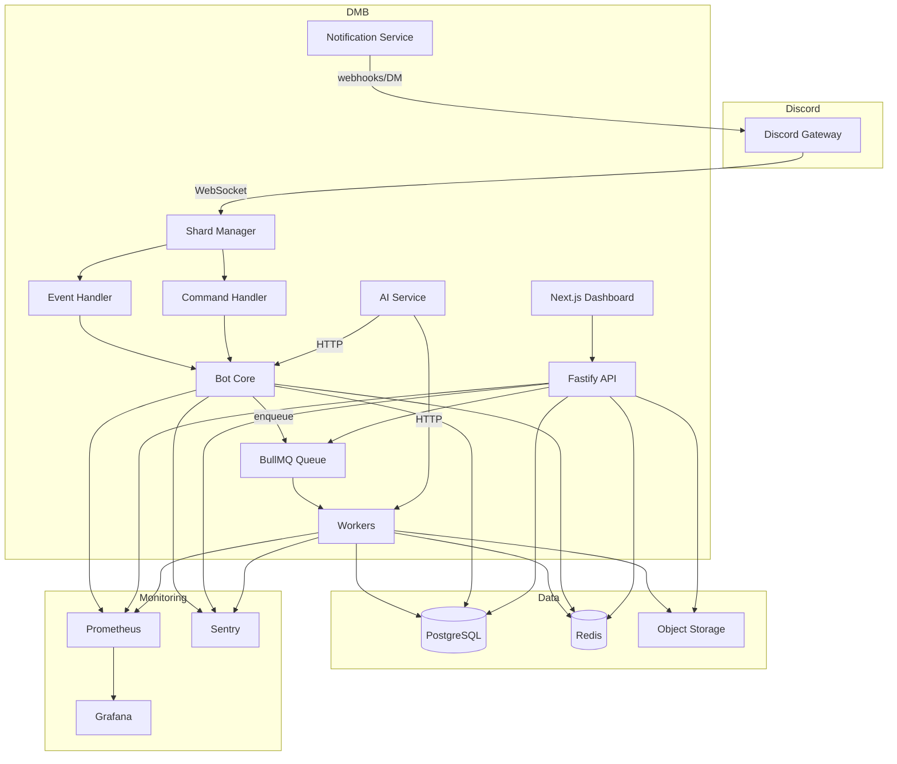
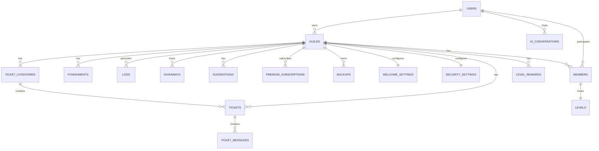
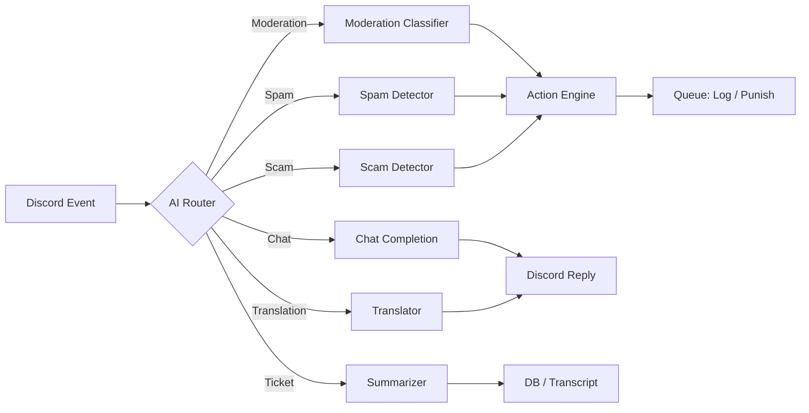
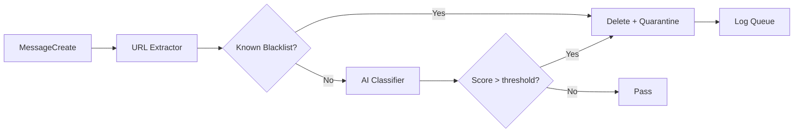
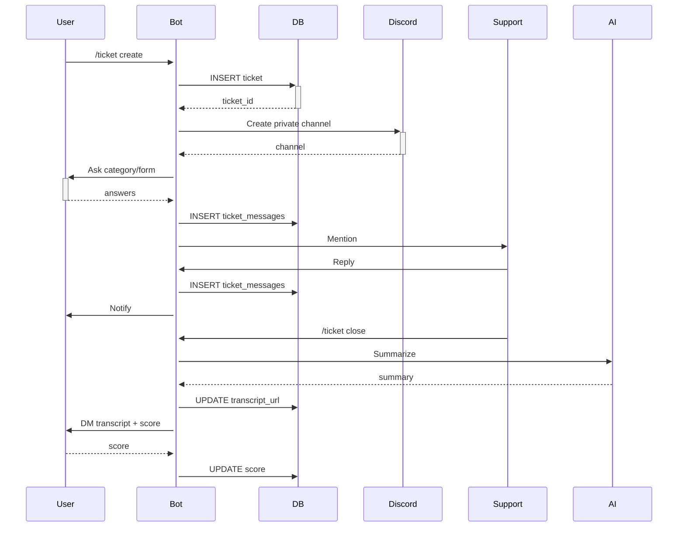
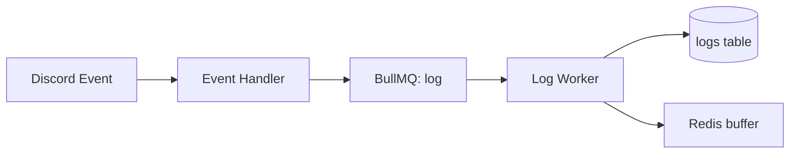

# DimaruBot (DMB) — Technical Design Document

**Version:** 1.0.0  
**Status:** Draft / Design Phase  
**Last Updated:** 2026-06-25  

---

## Table of Contents

1. [Product Vision](#1-product-vision)
2. [Technology Decision](#2-technology-decision)
3. [System Architecture](#3-system-architecture)
4. [File Structure](#4-file-structure)
5. [Module Architecture](#5-module-architecture)
6. [Database Design](#6-database-design)
7. [Redis Design](#7-redis-design)
8. [Command System](#8-command-system)
9. [Event System](#9-event-system)
10. [AI System](#10-ai-system)
11. [Security System](#11-security-system)
12. [Ticket System](#12-ticket-system)
13. [Economy System](#13-economy-system)
14. [Level System](#14-level-system)
15. [Log System](#15-log-system)
16. [Dashboard](#16-dashboard)
17. [REST API](#17-rest-api)
18. [Sharding](#18-sharding)
19. [Queue System](#19-queue-system)
20. [Performance](#20-performance)
21. [Error Handling](#21-error-handling)
22. [Monitoring](#22-monitoring)
23. [CI/CD](#23-cicd)
24. [Docker](#24-docker)
25. [Premium System](#25-premium-system)
26. [Revenue Model](#26-revenue-model)
27. [Risk Analysis](#27-risk-analysis)
28. [Development Roadmap](#28-development-roadmap)
29. [Final Architecture Summary](#29-final-architecture-summary)

---

## 1. Product Vision

### 1.1 Purpose
DimaruBot (DMB) is a next-generation, AI-powered, modular Discord server management platform. It consolidates moderation, ticketing, economy, levels, music, giveaways, analytics, and more into a single high-performance product.

### 1.2 Target Audience
- Community owners and moderators.
- Gaming, education, crypto, and creator servers.
- Enterprise teams using Discord for support.

### 1.3 Problems Solved
| Problem | Solution |
|--------|----------|
| Fragmented bot ecosystem | Single bot replaces many. |
| Inconsistent UX | Unified command, dashboard, and configuration model. |
| Security gaps | DMB Shield with real-time AI detection. |
| Poor scalability | Sharding, workers, queues, and Redis from day one. |
| Expensive premium tiers | Transparent Free / Premium / Premium+ model. |
| Limited analytics | Built-in analytics and dashboards. |

### 1.4 Differentiation from Competitors
| Competitor | Their Strength | DMB Advantage |
|-----------|--------------|---------------|
| MEE6 | Levels, music | Modular opt-in, AI moderation, no forced branding. |
| Dyno | Auto-moderation | Better AI scam detection, modern dashboard. |
| Carl-bot | Reaction roles | Type-safe codebase, faster deploys. |
| ProBot | Welcome, embeds | Unified premium, richer API. |
| YAGPDB | Custom commands | Type-safe automation engine. |
| Ticket Tool | Ticketing | AI summarization, satisfaction scoring. |
| Sapphire | Framework | DMB is an opinionated product, not just a framework. |

### 1.5 Unique Selling Proposition (USP)
**"One Bot. Endless Possibilities."** — DMB consolidates best-in-class moderation, AI-driven automation, native ticketing, economy, and analytics under one identity and dashboard.

### 1.6 Long-Term Goals
- Top-10 Discord bot by server count within 3 years.
- 99.95% uptime across all services.
- Public app marketplace for community modules.
- Enterprise SLAs and white-label deployments.

### 1.7 1-Year Roadmap
| Quarter | Milestones |
|--------|-------------|
| Q1 | Core bot, moderation, logging, welcome, auto/reaction roles, dashboard v1. |
| Q2 | Tickets, economy, levels, giveaways, AI assistant, mobile dashboard. |
| Q3 | Premium tiers, public API, analytics v1, sharding, monitoring. |
| Q4 | Mobile app prototype, enterprise features, marketplace beta, localization. |

### 1.8 3-Year Roadmap
- Year 1: Foundation, core modules, premium launch.
- Year 2: AI expansion, marketplace, mobile apps, enterprise contracts.
- Year 3: White-label, multi-region hosting, advanced analytics.

### 1.9 Brand Strategy
- **Visual identity:** Dark theme, neon blue (#00F0FF), neon purple (#B829DD), cyberpunk accents.
- **Voice:** Professional, concise, helpful, secure.
- **Distribution:** Bot listings, GitHub, partner servers, freemium funnel.

**Why this approach:** An opinionated, premium-feeling brand reduces cognitive load and increases trust. Alternatives include a playful brand or feature-specific branding; a unified cyberpunk identity is chosen for differentiation and premium positioning.

---

## 2. Technology Decision

### 2.1 Candidate Comparison
| Criteria | Node.js + TypeScript | Python | Go | Rust |
|---------|---------------------|--------|----|----|
| Performance | Very Good | Good | Excellent | Excellent |
| Development Speed | Excellent | Excellent | Good | Moderate |
| Discord Compatibility | Excellent | Good | Moderate | Moderate |
| Community Support | Largest | Large | Moderate | Growing |
| Library Maturity | Excellent | Very Good | Moderate | Moderate |
| Learning Curve | Low | Low | Moderate | High |
| Maintenance Cost | Low | Low | Moderate | High |
| Hiring Pool | Largest | Large | Moderate | Niche |
| Type Safety | With TypeScript | With mypy | Native | Native |
| AI/ML Integration | Good | Excellent | Good | Good |

### 2.2 Advantages / Disadvantages / Alternatives / Decision

**Node.js + TypeScript**
- **Advantages:** Largest Discord ecosystem, fastest iteration, strong package ecosystem, easy hiring, full-stack TypeScript with Next.js.
- **Disadvantages:** Single-threaded CPU bottlenecks, async complexity, possible memory leaks.
- **Alternatives:** Python (great for AI but weaker Gateway performance), Go (excellent concurrency but smaller Discord ecosystem), Rust (best performance but slowest iteration).
- **Decision:** **Node.js + TypeScript is selected.** It balances speed, ecosystem, and maintainability.

### 2.3 Final Stack
| Layer | Technology |
|-------|-----------|
| Bot Runtime | Node.js 20 LTS + TypeScript 5 |
| Discord Library | discord.js 14+ |
| API Framework | Fastify |
| Dashboard | Next.js 14 + React + TailwindCSS |
| ORM | Prisma |
| Database | PostgreSQL 16 |
| Cache / PubSub | Redis 7 |
| Queue | BullMQ |
| AI | OpenAI / Anthropic / self-hosted endpoints |
| Monitoring | Prometheus + Grafana + Sentry |
| CI/CD | GitHub Actions |
| Containerization | Docker + Docker Compose |
| Message Broker | Redis Streams |

---

## 3. System Architecture

### 3.1 Components
| Component | Responsibility |
|-----------|---------------|
| Discord Gateway | WebSocket connection with Discord. |
| Bot Core | Lifecycle, shard manager, module loader, DI. |
| Command Handler | Slash commands, context menus, buttons, modals. |
| Event Handler | Routes Discord events to module handlers. |
| API Server | Fastify REST API for dashboard and integrations. |
| Dashboard | Next.js web panel for configuration and analytics. |
| PostgreSQL | Persistent relational data. |
| Redis | Cache, sessions, rate limits, pub/sub, queues. |
| Queue System | BullMQ workers for AI, logs, analytics, tickets, giveaways. |
| AI Service | Microservice exposing AI endpoints; isolates cost and failure. |
| Logging Service | Normalized log ingestion and audit trail. |
| Analytics Service | Aggregates usage, command, and guild metrics. |
| Moderation Service | Punishments, warnings, auto-moderation, raid protection. |
| Notification Service | DM / webhook / email delivery. |

### 3.2 High-Level Architecture (Mermaid)



### 3.3 Rationale
- **Advantages:** Modular, scalable, observable, separates heavy work from Gateway latency.
- **Disadvantages:** Redis becomes a single point of failure for queues/cache.
- **Mitigations:** Redis Sentinel or Cluster; retry policies; dead-letter queues.

---

## 4. File Structure

```
DimaruBot/
├── apps/
│   ├── bot/
│   │   ├── src/
│   │   │   ├── core/
│   │   │   ├── commands/
│   │   │   ├── events/
│   │   │   ├── modules/
│   │   │   ├── services/
│   │   │   ├── utils/
│   │   │   └── index.ts
│   │   ├── package.json
│   │   └── tsconfig.json
│   ├── api/
│   │   ├── src/
│   │   │   ├── routes/
│   │   │   ├── middleware/
│   │   │   ├── controllers/
│   │   │   ├── services/
│   │   │   └── index.ts
│   │   ├── package.json
│   │   └── tsconfig.json
│   └── dashboard/
│       ├── src/
│       │   ├── app/
│       │   ├── components/
│       │   ├── hooks/
│       │   ├── lib/
│       │   └── styles/
│       ├── package.json
│       └── tailwind.config.ts
├── packages/
│   ├── shared/
│   ├── prisma/
│   ├── config/
│   └── logger/
├── modules/
│   ├── moderation/
│   ├── tickets/
│   ├── economy/
│   └── levels/
├── workers/
│   ├── ai.worker.ts
│   ├── log.worker.ts
│   ├── analytics.worker.ts
│   ├── ticket.worker.ts
│   └── giveaway.worker.ts
├── database/
│   ├── migrations/
│   ├── seeds/
│   └── docker/
├── infrastructure/
│   ├── docker/
│   ├── kubernetes/
│   ├── terraform/
│   └── monitoring/
├── docs/
│   ├── DIMARU_TECHNICAL_DESIGN.md
│   └── API.md
├── tests/
│   ├── unit/
│   ├── integration/
│   └── e2e/
├── .github/
│   └── workflows/
├── package.json
├── turbo.json
├── docker-compose.yml
└── README.md
```

### 4.1 Folder Purpose
| Path | Purpose |
|------|---------|
| `apps/bot` | Gateway runtime and command/event handling. |
| `apps/api` | Public REST API and dashboard backend. |
| `apps/dashboard` | Next.js admin panel. |
| `packages/shared` | Cross-app types, enums, schemas, utilities. |
| `packages/prisma` | Single source of truth for database schema. |
| `packages/config` | Environment validation and feature flags. |
| `packages/logger` | Pino-based structured logger. |
| `modules/` | Pluggable domain modules. |
| `workers/` | Background job processors. |
| `database/` | Migrations, seeds, and DB-specific assets. |
| `infrastructure/` | Docker, K8s, Terraform, and monitoring manifests. |

---

## 5. Module Architecture

Every module follows a **Plugin Interface** pattern.

```ts
// packages/shared/src/module.ts
export interface IModule {
  id: string;
  name: string;
  description: string;
  category: ModuleCategory;
  defaultEnabled: boolean;
  premium: boolean;
  commands?: CommandDefinition[];
  events?: EventDefinition[];
  settings?: SettingsSchema;
  onLoad(client: DmbClient): Promise<void>;
  onUnload(client: DmbClient): Promise<void>;
}
```

### 5.1 Modules Overview

| Module | Purpose | Key Features |
|--------|---------|--------------|
| **Moderation** | Ban, kick, mute, warn, timeout, purge, lockdown. | Punishments, warnings, appeals. |
| **Protection** | DMB Shield — raid, spam, scam, alt, permission abuse. | AI detection, quarantine, captcha. |
| **AI** | DMB AI assistant and analysis. | Chat, moderation, translation, summarization. |
| **Tickets** | Support ticket system. | Categories, transcripts, auto-close, scoring. |
| **Economy** | Virtual currency, shop, inventory, jobs. | Daily, transfer, market, quests. |
| **Levels** | XP and roles based on activity. | XP formula, rewards, leaderboards. |
| **Music** | Voice channel playback. | Lavalink integration, queue, playlists. |
| **Giveaways** | Prize management. | Requirements, multi-entries, reroll. |
| **Applications** | Staff/form applications. | Forms, review, voting. |
| **Logging** | Audit trail. | Message edits/deletes, joins, moderation. |
| **Welcome** | Greeting and farewell. | Embed builder, DM, roles. |
| **Reaction Roles** | Role assignment via reactions. | Exclusive, toggle, limit. |
| **Auto Roles** | Roles on join. | Delayed, conditional, bot/user. |
| **Statistics** | Server activity dashboards. | Members, messages, voice, charts. |
| **Suggestions** | Community suggestions. | Voting, status, anonymous. |
| **Verification** | CAPTCHA/role gates. | Button, modal, OAuth2, hCaptcha. |
| **Premium** | Premium feature management. | Subscriptions, entitlements, codes. |
| **Backup** | Server snapshot and restore. | Channels, roles, permissions. |
| **Automations** | Custom trigger-action engine. | Webhooks, scheduled messages. |

### 5.2 Module Example: Moderation

```ts
// apps/bot/src/modules/moderation/index.ts
import { IModule } from '@dmb/shared';

export default {
  id: 'moderation',
  name: 'Moderation',
  category: 'Moderation',
  defaultEnabled: true,
  premium: false,
  commands: [
    { name: 'ban', type: 'slash', permissions: ['BanMembers'] },
    { name: 'kick', type: 'slash', permissions: ['KickMembers'] },
    { name: 'warn', type: 'slash', permissions: ['ModerateMembers'] },
    { name: 'mute', type: 'slash', permissions: ['ModerateMembers'] },
    { name: 'purge', type: 'slash', permissions: ['ManageMessages'] },
    { name: 'lockdown', type: 'slash', permissions: ['ManageChannels'] },
  ],
  events: [
    { name: 'guildBanAdd', handler: 'onGuildBanAdd' },
    { name: 'guildMemberRemove', handler: 'onMemberLeave' },
  ],
  onLoad: async (client) => { /* register handlers */ },
  onUnload: async (client) => { /* unregister handlers */ },
} as IModule;
```

---

## 6. Database Design

### 6.1 Database: PostgreSQL
**Why PostgreSQL:** ACID compliance, JSONB for flexible settings, excellent indexing, mature hosting, great Prisma integration.

### 6.2 Core Tables

#### Users
```sql
CREATE TABLE users (
  id              BIGINT PRIMARY KEY,
  username        VARCHAR(32) NOT NULL,
  avatar          VARCHAR(40),
  locale          VARCHAR(10) DEFAULT 'en',
  is_premium      BOOLEAN DEFAULT FALSE,
  premium_tier    VARCHAR(20) CHECK (premium_tier IN ('free','premium','premium_plus')),
  premium_until   TIMESTAMPTZ,
  created_at      TIMESTAMPTZ DEFAULT NOW(),
  updated_at      TIMESTAMPTZ DEFAULT NOW()
);
CREATE INDEX idx_users_premium ON users(premium_tier, is_premium);
```

#### Guilds
```sql
CREATE TABLE guilds (
  id                BIGINT PRIMARY KEY,
  name              VARCHAR(100) NOT NULL,
  icon              VARCHAR(40),
  owner_id          BIGINT REFERENCES users(id),
  prefix            VARCHAR(10) DEFAULT '/',
  locale            VARCHAR(10) DEFAULT 'en',
  timezone          VARCHAR(50) DEFAULT 'UTC',
  is_premium        BOOLEAN DEFAULT FALSE,
  premium_tier      VARCHAR(20) DEFAULT 'free',
  premium_until     TIMESTAMPTZ,
  settings          JSONB DEFAULT '{}',
  enabled_modules   TEXT[] DEFAULT '{}',
  shard_id          INTEGER,
  created_at        TIMESTAMPTZ DEFAULT NOW(),
  updated_at        TIMESTAMPTZ DEFAULT NOW(),
  left_at           TIMESTAMPTZ
);
CREATE INDEX idx_guilds_premium ON guilds(premium_tier);
CREATE INDEX idx_guilds_shard ON guilds(shard_id);
CREATE INDEX idx_guilds_settings ON guilds USING GIN (settings);
```

#### Members
```sql
CREATE TABLE members (
  id              BIGINT PRIMARY KEY,
  user_id         BIGINT NOT NULL REFERENCES users(id),
  guild_id        BIGINT NOT NULL REFERENCES guilds(id),
  nickname        VARCHAR(32),
  roles           BIGINT[] DEFAULT '{}',
  joined_at       TIMESTAMPTZ,
  xp              INTEGER DEFAULT 0,
  level           INTEGER DEFAULT 0,
  wallet          BIGINT DEFAULT 0,
  bank            BIGINT DEFAULT 0,
  message_count   INTEGER DEFAULT 0,
  voice_minutes   INTEGER DEFAULT 0,
  last_message_at TIMESTAMPTZ,
  created_at      TIMESTAMPTZ DEFAULT NOW(),
  updated_at      TIMESTAMPTZ DEFAULT NOW(),
  UNIQUE(user_id, guild_id)
);
CREATE INDEX idx_members_guild ON members(guild_id);
CREATE INDEX idx_members_level ON members(guild_id, level DESC, xp DESC);
CREATE INDEX idx_members_economy ON members(guild_id, wallet DESC);
```

#### Economy
```sql
CREATE TABLE economy_settings (
  guild_id           BIGINT PRIMARY KEY REFERENCES guilds(id),
  currency_name      VARCHAR(32) DEFAULT 'Coin',
  currency_symbol    VARCHAR(8) DEFAULT '🪙',
  daily_amount       INTEGER DEFAULT 100,
  daily_streak_bonus INTEGER DEFAULT 10,
  settings           JSONB DEFAULT '{}'
);

CREATE TABLE economy_items (
  id          BIGSERIAL PRIMARY KEY,
  guild_id    BIGINT NOT NULL REFERENCES guilds(id),
  name        VARCHAR(100) NOT NULL,
  description TEXT,
  price       BIGINT NOT NULL,
  stock       INTEGER DEFAULT -1,
  role_id     BIGINT,
  metadata    JSONB DEFAULT '{}',
  UNIQUE(guild_id, name)
);

CREATE TABLE economy_inventory (
  id          BIGSERIAL PRIMARY KEY,
  member_id   BIGINT NOT NULL REFERENCES members(id),
  item_id     BIGINT NOT NULL REFERENCES economy_items(id),
  quantity    INTEGER DEFAULT 1,
  UNIQUE(member_id, item_id)
);
```

#### Transactions
```sql
CREATE TABLE transactions (
  id            BIGSERIAL PRIMARY KEY,
  guild_id      BIGINT NOT NULL REFERENCES guilds(id),
  user_id       BIGINT NOT NULL REFERENCES users(id),
  type          VARCHAR(20) NOT NULL,
  amount        BIGINT NOT NULL,
  balance_after BIGINT,
  metadata      JSONB DEFAULT '{}',
  created_at    TIMESTAMPTZ DEFAULT NOW()
);
CREATE INDEX idx_transactions_user ON transactions(guild_id, user_id, created_at DESC);
CREATE INDEX idx_transactions_type ON transactions(type);
```

#### Levels
```sql
CREATE TABLE levels (
  member_id      BIGINT PRIMARY KEY REFERENCES members(id),
  xp             INTEGER DEFAULT 0,
  level          INTEGER DEFAULT 0,
  messages       INTEGER DEFAULT 0,
  voice_xp       INTEGER DEFAULT 0,
  last_awarded_at TIMESTAMPTZ,
  updated_at     TIMESTAMPTZ DEFAULT NOW()
);
```

#### LevelRewards
```sql
CREATE TABLE level_rewards (
  id              BIGSERIAL PRIMARY KEY,
  guild_id        BIGINT NOT NULL REFERENCES guilds(id),
  level           INTEGER NOT NULL,
  role_id         BIGINT NOT NULL,
  remove_previous BOOLEAN DEFAULT FALSE,
  UNIQUE(guild_id, level)
);
CREATE INDEX idx_level_rewards_guild ON level_rewards(guild_id);
```

#### TicketCategories
```sql
CREATE TABLE ticket_categories (
  id                BIGSERIAL PRIMARY KEY,
  guild_id          BIGINT NOT NULL REFERENCES guilds(id),
  name              VARCHAR(100) NOT NULL,
  description       TEXT,
  parent_channel_id BIGINT,
  support_role_ids  BIGINT[] DEFAULT '{}',
  max_open          INTEGER DEFAULT 3,
  auto_close_hours  INTEGER DEFAULT 48,
  form_enabled      BOOLEAN DEFAULT FALSE,
  form_fields       JSONB DEFAULT '[]',
  created_at        TIMESTAMPTZ DEFAULT NOW()
);
CREATE INDEX idx_ticket_categories_guild ON ticket_categories(guild_id);
```

#### Tickets
```sql
CREATE TABLE tickets (
  id              BIGSERIAL PRIMARY KEY,
  guild_id        BIGINT NOT NULL REFERENCES guilds(id),
  channel_id      BIGINT UNIQUE,
  category_id     BIGINT NOT NULL REFERENCES ticket_categories(id),
  user_id         BIGINT NOT NULL REFERENCES users(id),
  status          VARCHAR(20) DEFAULT 'open',
  priority        VARCHAR(10) DEFAULT 'normal',
  assigned_to     BIGINT REFERENCES users(id),
  score           INTEGER,
  created_at      TIMESTAMPTZ DEFAULT NOW(),
  closed_at       TIMESTAMPTZ,
  closed_by       BIGINT REFERENCES users(id),
  transcript_url  VARCHAR(255)
);
CREATE INDEX idx_tickets_guild ON tickets(guild_id, status);
CREATE INDEX idx_tickets_user ON tickets(user_id);
```

#### TicketMessages
```sql
CREATE TABLE ticket_messages (
  id            BIGSERIAL PRIMARY KEY,
  ticket_id     BIGINT NOT NULL REFERENCES tickets(id) ON DELETE CASCADE,
  user_id       BIGINT,
  content       TEXT,
  attachments   JSONB DEFAULT '[]',
  is_internal   BOOLEAN DEFAULT FALSE,
  created_at    TIMESTAMPTZ DEFAULT NOW()
);
CREATE INDEX idx_ticket_messages_ticket ON ticket_messages(ticket_id, created_at);
```

#### Punishments
```sql
CREATE TABLE punishments (
  id            BIGSERIAL PRIMARY KEY,
  guild_id      BIGINT NOT NULL REFERENCES guilds(id),
  user_id       BIGINT NOT NULL REFERENCES users(id),
  moderator_id  BIGINT NOT NULL REFERENCES users(id),
  type          VARCHAR(20) NOT NULL,
  reason        TEXT,
  duration      INTEGER,
  expires_at    TIMESTAMPTZ,
  revoked       BOOLEAN DEFAULT FALSE,
  revoked_by    BIGINT REFERENCES users(id),
  revoked_reason TEXT,
  evidence      JSONB DEFAULT '[]',
  created_at    TIMESTAMPTZ DEFAULT NOW()
);
CREATE INDEX idx_punishments_guild ON punishments(guild_id, user_id, created_at DESC);
CREATE INDEX idx_punishments_expires ON punishments(expires_at) WHERE expires_at IS NOT NULL;
```

#### Warnings
```sql
CREATE TABLE warnings (
  id            BIGSERIAL PRIMARY KEY,
  guild_id      BIGINT NOT NULL REFERENCES guilds(id),
  user_id       BIGINT NOT NULL REFERENCES users(id),
  moderator_id  BIGINT NOT NULL REFERENCES users(id),
  reason        TEXT,
  points        INTEGER DEFAULT 1,
  active        BOOLEAN DEFAULT TRUE,
  created_at    TIMESTAMPTZ DEFAULT NOW()
);
CREATE INDEX idx_warnings_user ON warnings(guild_id, user_id, active);
```

#### Logs
```sql
CREATE TABLE logs (
  id          BIGSERIAL PRIMARY KEY,
  guild_id    BIGINT NOT NULL REFERENCES guilds(id),
  module      VARCHAR(40) NOT NULL,
  event_type  VARCHAR(60) NOT NULL,
  user_id     BIGINT,
  target_id   BIGINT,
  channel_id  BIGINT,
  message_id  BIGINT,
  payload     JSONB NOT NULL,
  created_at  TIMESTAMPTZ DEFAULT NOW()
);
CREATE INDEX idx_logs_guild ON logs(guild_id, created_at DESC);
CREATE INDEX idx_logs_event ON logs(guild_id, event_type, created_at DESC);
CREATE INDEX idx_logs_payload ON logs USING GIN (payload);
```

#### ReactionRoles
```sql
CREATE TABLE reaction_roles (
  id          BIGSERIAL PRIMARY KEY,
  guild_id    BIGINT NOT NULL REFERENCES guilds(id),
  message_id  BIGINT NOT NULL,
  channel_id  BIGINT NOT NULL,
  emoji       VARCHAR(100) NOT NULL,
  role_id     BIGINT NOT NULL,
  mode        VARCHAR(20) DEFAULT 'toggle',
  max         INTEGER DEFAULT 0,
  UNIQUE(message_id, emoji)
);
CREATE INDEX idx_reaction_roles_message ON reaction_roles(message_id);
CREATE INDEX idx_reaction_roles_guild ON reaction_roles(guild_id);
```

#### AutoRoles
```sql
CREATE TABLE auto_roles (
  id            BIGSERIAL PRIMARY KEY,
  guild_id      BIGINT NOT NULL REFERENCES guilds(id),
  role_id       BIGINT NOT NULL,
  delay_minutes INTEGER DEFAULT 0,
  bot_only      BOOLEAN DEFAULT FALSE,
  human_only    BOOLEAN DEFAULT FALSE,
  UNIQUE(guild_id, role_id)
);
CREATE INDEX idx_auto_roles_guild ON auto_roles(guild_id);
```

#### WelcomeSettings
```sql
CREATE TABLE welcome_settings (
  guild_id             BIGINT PRIMARY KEY REFERENCES guilds(id),
  enabled              BOOLEAN DEFAULT FALSE,
  channel_id           BIGINT,
  dm_enabled           BOOLEAN DEFAULT FALSE,
  message_content      TEXT,
  embeds               JSONB DEFAULT '[]',
  farewell_enabled     BOOLEAN DEFAULT FALSE,
  farewell_channel_id  BIGINT,
  farewell_content     TEXT,
  auto_role_ids        BIGINT[] DEFAULT '{}'
);
```

#### SecuritySettings
```sql
CREATE TABLE security_settings (
  guild_id               BIGINT PRIMARY KEY REFERENCES guilds(id),
  raid_enabled           BOOLEAN DEFAULT FALSE,
  raid_threshold         INTEGER DEFAULT 10,
  raid_window_seconds    INTEGER DEFAULT 10,
  raid_action            VARCHAR(20) DEFAULT 'lockdown',
  spam_enabled           BOOLEAN DEFAULT FALSE,
  spam_sensitivity       INTEGER DEFAULT 3,
  scam_enabled           BOOLEAN DEFAULT TRUE,
  mass_mention_enabled   BOOLEAN DEFAULT FALSE,
  mass_mention_threshold INTEGER DEFAULT 5,
  alt_account_days       INTEGER DEFAULT 7,
  verification_level     VARCHAR(20) DEFAULT 'low',
  quarantine_role_id     BIGINT,
  mute_role_id           BIGINT,
  log_channel_id         BIGINT,
  updated_at             TIMESTAMPTZ DEFAULT NOW()
);
```

#### Giveaways
```sql
CREATE TABLE giveaways (
  id                 BIGSERIAL PRIMARY KEY,
  guild_id           BIGINT NOT NULL REFERENCES guilds(id),
  channel_id         BIGINT NOT NULL,
  message_id         BIGINT,
  prize              VARCHAR(255) NOT NULL,
  description        TEXT,
  winner_count       INTEGER DEFAULT 1,
  ends_at            TIMESTAMPTZ NOT NULL,
  required_role_id   BIGINT,
  required_invites   INTEGER DEFAULT 0,
  bonus_entries      JSONB DEFAULT '[]',
  participants       BIGINT[] DEFAULT '{}',
  winners            BIGINT[] DEFAULT '{}',
  status             VARCHAR(20) DEFAULT 'active',
  created_by         BIGINT NOT NULL REFERENCES users(id),
  created_at         TIMESTAMPTZ DEFAULT NOW()
);
CREATE INDEX idx_giveaways_guild ON giveaways(guild_id, status);
CREATE INDEX idx_giveaways_ends ON giveaways(ends_at) WHERE status = 'active';
```

#### Applications
```sql
CREATE TABLE applications (
  id                BIGSERIAL PRIMARY KEY,
  guild_id          BIGINT NOT NULL REFERENCES guilds(id),
  name              VARCHAR(100) NOT NULL,
  description       TEXT,
  form_fields       JSONB NOT NULL,
  review_channel_id BIGINT,
  accepted_role_id  BIGINT,
  status            VARCHAR(20) DEFAULT 'active',
  created_at        TIMESTAMPTZ DEFAULT NOW()
);

CREATE TABLE application_submissions (
  id              BIGSERIAL PRIMARY KEY,
  application_id  BIGINT NOT NULL REFERENCES applications(id),
  user_id         BIGINT NOT NULL REFERENCES users(id),
  answers         JSONB NOT NULL,
  status          VARCHAR(20) DEFAULT 'pending',
  reviewer_id     BIGINT REFERENCES users(id),
  reviewed_at     TIMESTAMPTZ,
  created_at      TIMESTAMPTZ DEFAULT NOW()
);
CREATE INDEX idx_applications_guild ON applications(guild_id);
CREATE INDEX idx_application_submissions_user ON application_submissions(application_id, user_id);
```

#### Suggestions
```sql
CREATE TABLE suggestions (
  id          BIGSERIAL PRIMARY KEY,
  guild_id    BIGINT NOT NULL REFERENCES guilds(id),
  user_id     BIGINT NOT NULL REFERENCES users(id),
  content     TEXT NOT NULL,
  message_id  BIGINT,
  channel_id  BIGINT,
  status      VARCHAR(20) DEFAULT 'pending',
  upvotes     INTEGER DEFAULT 0,
  downvotes   INTEGER DEFAULT 0,
  anonymous   BOOLEAN DEFAULT FALSE,
  created_at  TIMESTAMPTZ DEFAULT NOW()
);
CREATE INDEX idx_suggestions_guild ON suggestions(guild_id, status);
```

#### PremiumSubscriptions
```sql
CREATE TABLE premium_subscriptions (
  id            BIGSERIAL PRIMARY KEY,
  user_id       BIGINT REFERENCES users(id),
  guild_id      BIGINT REFERENCES guilds(id),
  tier          VARCHAR(20) NOT NULL,
  provider      VARCHAR(20) NOT NULL,
  provider_subscription_id VARCHAR(255),
  starts_at     TIMESTAMPTZ DEFAULT NOW(),
  ends_at       TIMESTAMPTZ NOT NULL,
  is_active     BOOLEAN DEFAULT TRUE,
  metadata      JSONB DEFAULT '{}'
);
CREATE INDEX idx_premium_user ON premium_subscriptions(user_id);
CREATE INDEX idx_premium_guild ON premium_subscriptions(guild_id);
CREATE INDEX idx_premium_active ON premium_subscriptions(ends_at) WHERE is_active = TRUE;
```

#### AIConversations
```sql
CREATE TABLE ai_conversations (
  id            BIGSERIAL PRIMARY KEY,
  guild_id      BIGINT REFERENCES guilds(id),
  user_id       BIGINT REFERENCES users(id),
  channel_id    BIGINT,
  thread_id     BIGINT,
  model         VARCHAR(50) NOT NULL,
  messages      JSONB NOT NULL DEFAULT '[]',
  token_usage   INTEGER DEFAULT 0,
  cost_usd      DECIMAL(10,6) DEFAULT 0,
  created_at    TIMESTAMPTZ DEFAULT NOW(),
  updated_at    TIMESTAMPTZ DEFAULT NOW()
);
CREATE INDEX idx_ai_conversations_user ON ai_conversations(guild_id, user_id, updated_at DESC);
```

#### AuditEvents
```sql
CREATE TABLE audit_events (
  id            BIGSERIAL PRIMARY KEY,
  guild_id      BIGINT REFERENCES guilds(id),
  user_id       BIGINT REFERENCES users(id),
  action        VARCHAR(60) NOT NULL,
  entity        VARCHAR(40) NOT NULL,
  entity_id     BIGINT,
  changes       JSONB DEFAULT '{}',
  ip_address    INET,
  user_agent    TEXT,
  created_at    TIMESTAMPTZ DEFAULT NOW()
);
CREATE INDEX idx_audit_events_guild ON audit_events(guild_id, created_at DESC);
CREATE INDEX idx_audit_events_action ON audit_events(entity, action);
```

#### Backups
```sql
CREATE TABLE backups (
  id            BIGSERIAL PRIMARY KEY,
  guild_id      BIGINT NOT NULL REFERENCES guilds(id),
  name          VARCHAR(100),
  size_bytes    BIGINT,
  snapshot      JSONB NOT NULL,
  created_by    BIGINT NOT NULL REFERENCES users(id),
  created_at    TIMESTAMPTZ DEFAULT NOW()
);
CREATE INDEX idx_backups_guild ON backups(guild_id, created_at DESC);
```

### 6.3 ER Diagram



## 7. Redis Design

### 7.1 Data Stored in Redis
| Key Space | Purpose | TTL |
|-----------|---------|-----|
| `dmb:cd:<guild>:<user>:<cmd>` | Per-user command cooldowns | 60–300s |
| `dmb:rate:<guild>:<user>` | Message/action rate limits | 10s |
| `dmb:cache:guild:<id>` | Guild settings cache | 300s |
| `dmb:cache:user:<id>` | User profile cache | 600s |
| `dmb:cache:member:<guild>:<user>` | Member stats cache | 300s |
| `dmb:session:<jwt>` | Dashboard sessions | 7d |
| `dmb:gateway:<shard>` | Shard presence cache | 60s |
| `dmb:temp:log:<guild>` | Recent log buffer | 3600s |
| `dmb:lock:<resource>` | Distributed locks | 30s |
| `dmb:shield:<guild>:raid` | Raid detection window | 60s |
| `dmb:ai:rate:<guild>` | AI call quota | 1h |
| `dmb:xp:<guild>:<user>` | XP cooldown buckets | 60s |
| `dmb:economy:daily:<guild>:<user>` | Daily claim flags | 24h |
| `dmb:analytics:<guild>:<metric>` | Aggregated counters | 300s |
| `dmb:transcript:queue:<id>` | Transcript job state | 1h |

### 7.2 TTL Strategy
- **Hot data (settings, members):** 5 minutes.
- **Cooldowns/flags:** Exact duration.
- **Sessions:** 7 days with sliding refresh.
- **Rate limits:** Sliding window.
- **Temporary logs:** 1 hour before flushing.
- **AI rate quota:** 1 hour per guild.

### 7.3 Redis Example
```ts
const redisKeys = {
  cooldown: (g: string, u: string, cmd: string) => `dmb:cd:${g}:${u}:${cmd}`,
  guildCache: (g: string) => `dmb:cache:guild:${g}`,
  session: (token: string) => `dmb:session:${token}`,
  aiQuota: (g: string) => `dmb:ai:rate:${g}`,
  xpBucket: (g: string, u: string) => `dmb:xp:${g}:${u}`,
};

await redis.set(redisKeys.cooldown(guildId, userId, command), '1', 'EX', 60, 'NX');
```

---

## 8. Command System

### 8.1 Interaction Types
| Type | Use Case |
|------|----------|
| Slash Commands | Primary command interface. |
| Buttons | Confirmation, pagination, ticket actions. |
| Select Menus | Multi-choice config, role selection. |
| Modals | Forms (applications, tickets, suggestions). |
| Context Menus | Quick actions on users/messages. |

### 8.2 Command Handler
```ts
interface Command {
  data: SlashCommandBuilder | ContextMenuCommandBuilder;
  cooldown?: number;
  permissions?: PermissionResolvable[];
  premium?: boolean;
  execute: (interaction: ChatInputCommandInteraction, ctx: CommandContext) => Promise<void>;
}

const commands = new Map<string, Command>();

export async function registerCommands(client: DmbClient) {
  const rest = new REST().setToken(process.env.DISCORD_TOKEN);
  await rest.put(Routes.applicationCommands(client.application.id), {
    body: Array.from(commands.values()).map(c => c.data.toJSON()),
  });
}

export async function handleInteraction(interaction: Interaction) {
  if (!interaction.isChatInputCommand()) return;
  const cmd = commands.get(interaction.commandName);
  if (!cmd) return;

  const cdKey = redisKeys.cooldown(interaction.guildId, interaction.user.id, cmd.data.name);
  if (await redis.get(cdKey)) {
    return interaction.reply({ content: 'Cooldown active.', ephemeral: true });
  }

  if (cmd.permissions && !interaction.memberPermissions?.has(cmd.permissions)) {
    return interaction.reply({ content: 'Insufficient permissions.', ephemeral: true });
  }

  if (cmd.premium && !(await isPremium(interaction.guildId))) {
    return interaction.reply({ content: 'Premium required.', ephemeral: true });
  }

  await cmd.execute(interaction, createContext(interaction));
  await redis.set(cdKey, '1', 'EX', cmd.cooldown ?? 5);
}
```

### 8.3 Command Example
```ts
export default {
  data: new SlashCommandBuilder()
    .setName('warn')
    .setDescription('Warn a user')
    .addUserOption(opt => opt.setName('user').setDescription('Target user').setRequired(true))
    .addStringOption(opt => opt.setName('reason').setDescription('Reason').setRequired(false)),
  permissions: ['ModerateMembers'],
  cooldown: 5,
  async execute(interaction, ctx) { /* implementation */ },
} as Command;
```

---

## 9. Event System

### 9.1 Event Categories
| Category | Events | Purpose |
|----------|--------|---------|
| **Guild Events** | `guildCreate`, `guildDelete`, `guildUpdate`, `guildUnavailable` | Lifecycle, onboarding, analytics. |
| **Member Events** | `guildMemberAdd`, `guildMemberRemove`, `guildMemberUpdate`, `guildMemberAvailable` | Welcome, farewell, auto-roles, verification. |
| **Channel Events** | `channelCreate`, `channelDelete`, `channelUpdate`, `pinsUpdate` | Logging, backup, raid detection. |
| **Role Events** | `roleCreate`, `roleDelete`, `roleUpdate` | Logging, audit trail. |
| **Message Events** | `messageCreate`, `messageDelete`, `messageUpdate`, `messageBulkDelete` | Auto-mod, XP, logging, AI. |
| **Thread Events** | `threadCreate`, `threadDelete`, `threadUpdate`, `threadMembersUpdate` | Logging, auto-join. |
| **Voice Events** | `voiceStateUpdate` | Voice XP, temp channels, logging. |
| **Interaction Events** | `interactionCreate` | Commands, buttons, modals, menus. |
| **Reaction Events** | `messageReactionAdd`, `messageReactionRemove` | Reaction roles, logging. |
| **Invite Events** | `inviteCreate`, `inviteDelete` | Logging, analytics. |
| **Ban Events** | `guildBanAdd`, `guildBanRemove` | Logging, punishment sync. |
| **Presence Events** | `presenceUpdate` | Status logging, analytics (opt-in). |
| **Typing Events** | `typingStart` | Analytics, rate limits. |

### 9.2 Event Handler Pattern
```ts
interface EventDefinition {
  name: keyof ClientEvents;
  once?: boolean;
  handler: (client: DmbClient, ...args: any[]) => Promise<void>;
}

export function registerEvents(client: DmbClient, events: EventDefinition[]) {
  for (const event of events) {
    const fn = async (...args: any[]) => {
      try {
        await event.handler(client, ...args);
      } catch (err) {
        logger.error({ event: event.name, err }, 'Event handler error');
        Sentry.captureException(err);
      }
    };
    if (event.once) client.once(event.name, fn);
    else client.on(event.name, fn);
  }
}
```

---

## 10. AI System

### 10.1 DMB AI Features
| Feature | Description |
|---------|-------------|
| Chat Assistant | Conversational AI with context. |
| Moderation Analysis | Toxicity, harassment, hate speech detection. |
| Spam Detection | Pattern + heuristic detection. |
| Scam Detection | URL + message analysis for phishing/NFT/crypto scams. |
| Support Helper | Suggests answers before ticket creation. |
| Ticket Summarization | Auto-summarizes ticket transcript. |
| Message Translation | Translates messages to server locale. |
| Server Analysis | Activity, sentiment, engagement insights. |
| Content Categorization | Tags content for auto-moderation. |

### 10.2 AI Architecture


### 10.3 Prompt System
```ts
export const moderationPrompt = (content: string, locale: string) => `
You are a Discord moderation assistant for locale "${locale}".
Analyze the following message and return ONLY JSON:
{
  "toxicity": 0-1,
  "spam": 0-1,
  "scam": 0-1,
  "reason": "short explanation"
}

Message: """${content}"""
`;

import { z } from 'zod';
export const moderationSchema = z.object({
  toxicity: z.number().min(0).max(1),
  spam: z.number().min(0).max(1),
  scam: z.number().min(0).max(1),
  reason: z.string(),
});
```

### 10.4 Rate Limit & Cost Optimization
| Strategy | Implementation |
|----------|---------------|
| Tiered quotas | Free: 50/day; Premium: 500/day; Premium+: 2000/day. |
| Token limits | Max 500 tokens per request; 4k context. |
| Caching | Hash content and cache classification for 1 hour. |
| Local model fallback | Ollama/vLLM for spam/scam classification. |
| Async processing | Non-critical AI calls go to BullMQ. |
| Cost caps | Per-guild max daily spend; kill switch. |

---

## 11. Security System

### 11.1 DMB Shield
Real-time protection layer running on message/member events and asynchronously for heavy analysis.

### 11.2 Protection Systems
| System | Mechanism | Action |
|--------|-----------|--------|
| **Raid Protection** | Track joins per window; detect mass joins, alt accounts. | Lockdown, verification, quarantine. |
| **Spam Protection** | Rate limiting + duplicate detection + AI. | Mute, delete, warn. |
| **Ad Protection** | Regex + domain blacklist for invites/links. | Delete, warn, mute. |
| **Scam Link Protection** | URL analysis + AI + phishing DB. | Delete, quarantine, warn. |
| **Mass Mention Protection** | Count mentions per message. | Delete, timeout, warn. |
| **Channel Deletion Protection** | Detect mass channel deletion. | Lock server, alert admins, restore. |
| **Role Deletion Protection** | Detect mass role deletion. | Alert, lock roles, restore. |
| **Bot Attack Protection** | Detect fake bot OAuth / mass DM. | Kick, ban, report. |
| **Permission Escalation Protection** | Monitor dangerous permission grants. | Log, alert, auto-revert. |

### 11.3 Shield Implementation
```ts
export async function detectRaid(guild: Guild, settings: SecuritySettings) {
  const key = `dmb:shield:${guild.id}:raid:joins`;
  const count = await redis.incr(key);
  if (count === 1) await redis.expire(key, settings.raid_window_seconds);

  if (count > settings.raid_threshold) {
    await activateRaidLockdown(guild, settings);
    await notifySecurityChannel(guild, `Raid detected: ${count} joins in ${settings.raid_window_seconds}s`);
  }
}

export async function activateRaidLockdown(guild: Guild, settings: SecuritySettings) {
  const channels = await guild.channels.fetch();
  for (const channel of channels.values()) {
    if (channel.isTextBased()) {
      await channel.permissionOverwrites.edit(guild.roles.everyone, { SendMessages: false });
    }
  }
  await redis.set(`dmb:shield:${guild.id}:raid`, '1', 'EX', 300);
}
```

### 11.4 Scam Detection Pipeline


---

## 12. Ticket System

### 12.1 DMB Tickets Features
- Ticket categories with custom forms.
- Private channel creation with permission sync.
- Transcript export (HTML/JSON).
- Auto-close on inactivity.
- Assignment and claim system.
- Internal notes and moderator chat.
- Satisfaction scoring.
- AI summarization.

### 12.2 Flow


---

## 13. Economy System

### 13.1 DMB Economy Features
- Currency per guild (`wallet`, `bank` in `members`).
- Daily command with streak bonus.
- Market with items.
- Inventory.
- Transfer between users.
- Quests / jobs.
- Leaderboards.

### 13.2 Anti-Abuse
| Abuse Vector | Mitigation |
|-------------|-----------|
| Self-transfer alts | Transfer limits, alt detection. |
| Daily farming | 24h cooldown per guild/user. |
| Message spam for money | Economy cooldown decoupled from XP. |
| Gambling exploits | House edge, max bet limits, rate limits. |
| Botting | Captcha on large transactions, anomaly detection. |

### 13.3 Tables
Already defined in `economy_settings`, `economy_items`, `economy_inventory`, `transactions`.

---

## 14. Level System

### 14.1 DMB Levels Features
- XP per message and voice minute.
- Anti-spam XP cooldown.
- Level rewards (roles).
- Global and guild leaderboards.
- Rank card generation.

### 14.2 XP Formulas
```
XP_TO_LEVEL(level) = BASE * (level ^ GROWTH)
Default: BASE = 100, GROWTH = 1.8

Required XP for level N:
required(N) = 100 * N^1.8

Level from XP:
level = floor( (XP / 100) ^ (1 / 1.8) )
```

| Action | XP Gain |
|--------|---------|
| Text message | 15–25 (randomized) |
| Voice minute | 5 |
| Streak bonus | +10% |
| Premium bonus | +20% |

### 14.3 Cooldown
```ts
const xpKey = `dmb:xp:${guildId}:${userId}`;
if (await redis.get(xpKey)) return;
await redis.set(xpKey, '1', 'EX', 60);
```

---

## 15. Log System

### 15.1 DMB Logs Events
| Event | Payload Fields |
|-------|----------------|
| message_deleted | message_id, channel_id, author_id, content, attachments |
| message_edited | message_id, old_content, new_content, author_id |
| member_joined | user_id, account_age, invite_code |
| member_left | user_id, roles, joined_at |
| member_banned | user_id, moderator_id, reason |
| member_unbanned | user_id, moderator_id |
| role_created | role_id, name, permissions |
| role_deleted | role_id, name |
| channel_created | channel_id, name, type |
| channel_deleted | channel_id, name |
| voice_joined | user_id, channel_id |
| voice_left | user_id, channel_id |
| nickname_changed | user_id, old, new |
| punishment_applied | user_id, type, moderator, reason |
| command_used | user_id, command, args, channel_id |
| security_event | type, user_id, score, action |

### 15.2 Log Architecture


---

## 16. Dashboard

### 16.1 Tech Stack
- **Next.js 14 App Router**
- **React 18**
- **TailwindCSS + shadcn/ui**
- **TypeScript**
- **React Query / SWR**
- **Zustand**
- **Recharts**

### 16.2 Pages
| Page | Purpose |
|------|---------|
| **Overview** | Server stats, health, recent logs, quick actions. |
| **Moderation** | Punishments, warnings, auto-mod settings. |
| **Tickets** | Categories, open tickets, transcripts, ratings. |
| **AI** | Quota, model selection, prompt templates, thresholds. |
| **Logs** | Filterable log feed, exports, audit events. |
| **Statistics** | Growth charts, message activity, voice, retention. |
| **Premium** | Plans, billing, invoice history, partner codes. |
| **Settings** | General, locale, modules, roles, permissions. |

### 16.3 Wireframe Structure
```
┌─────────────────────────────────────────────┐
│  Sidebar  │  Header: Guild / User / Search  │
│           ├─────────────────────────────────┤
│  Overview │  KPI Cards                      │
│  Moderation│  Charts / Tables               │
│  Tickets  │  Action Panels                  │
│  AI       │                                 │
│  Logs     │                                 │
│  Stats    │                                 │
│  Premium  │                                 │
└─────────────────────────────────────────────┘
```

---

## 17. REST API

### 17.1 API Design
- **Framework:** Fastify
- **Auth:** Discord OAuth2 + JWT
- **Format:** JSON
- **Versioning:** `/api/v1/`
- **Rate limiting:** Per-user + per-guild via Redis

### 17.2 Endpoint Examples
```
GET    /api/v1/guilds
GET    /api/v1/guilds/:id
PATCH  /api/v1/guilds/:id/settings
GET    /api/v1/guilds/:id/members
GET    /api/v1/guilds/:id/members/:userId
GET    /api/v1/guilds/:id/punishments
POST   /api/v1/guilds/:id/punishments
GET    /api/v1/guilds/:id/tickets
POST   /api/v1/guilds/:id/tickets
GET    /api/v1/guilds/:id/tickets/:id
DELETE /api/v1/guilds/:id/tickets/:id
GET    /api/v1/guilds/:id/tickets/:id/transcript
GET    /api/v1/guilds/:id/logs
GET    /api/v1/guilds/:id/analytics
GET    /api/v1/guilds/:id/levels
GET    /api/v1/guilds/:id/economy
POST   /api/v1/guilds/:id/economy/transfer
POST   /api/v1/auth/discord
POST   /api/v1/auth/refresh
GET    /api/v1/me
GET    /api/v1/me/subscriptions
```

### 17.3 JWT System
```ts
import jwt from 'jsonwebtoken';

export function createTokens(userId: string, guildIds: string[]) {
  const access = jwt.sign(
    { sub: userId, guilds: guildIds, type: 'access' },
    process.env.JWT_ACCESS_SECRET,
    { expiresIn: '15m' }
  );
  const refresh = jwt.sign(
    { sub: userId, type: 'refresh' },
    process.env.JWT_REFRESH_SECRET,
    { expiresIn: '7d' }
  );
  return { access, refresh };
}
```

- Access token: 15 minutes, stored in memory.
- Refresh token: 7 days, stored in httpOnly cookie + Redis allowlist.
- Redis stores `dmb:session:<refreshToken>` with metadata and IP binding.

## 18. Sharding

### 18.1 Discord.js Sharding
Discord.js sharding is mandatory once a bot exceeds ~2,500 guilds. DMB uses `ShardingManager` and later custom orchestration.

### 18.2 Scale Tiers
| Guilds | Shards | Machines | Strategy |
|--------|--------|----------|----------|
| 100 | 1 | 1 | Single process, no sharding. |
| 1,000 | 1 | 1 | Single shard, still fine. |
| 10,000 | 4 | 2 | ShardingManager, 2–4 shards per machine. |
| 100,000 | 40 | 8–12 | Custom orchestration, Redis pub/sub, stateless workers. |

### 18.3 Sharding Manager
```ts
import { ShardingManager } from 'discord.js';

const manager = new ShardingManager('./dist/index.js', {
  token: process.env.DISCORD_TOKEN,
  totalShards: 'auto',
  shardList: 'auto',
  respawn: true,
});

manager.on('shardCreate', shard => {
  logger.info(`Shard ${shard.id} launched`);
  shard.on('error', err => logger.error({ shard: shard.id, err }, 'Shard error'));
});

manager.spawn();
```

### 18.4 Inter-Shard Communication
```ts
await client.shard.broadcastEval((c, ctx) => {
  const guild = c.guilds.cache.get(ctx.guildId);
  return guild ? guild.memberCount : null;
}, { context: { guildId } });

redisSubscriber.subscribe('dmb:shard:events');
redisSubscriber.on('message', (channel, message) => {
  // route to local shard
});
```

---

## 19. Queue System

### 19.1 BullMQ Architecture
BullMQ is Redis-backed and supports delayed jobs, retries, priorities, and rate limiting.

| Queue | Purpose | Workers | Priority |
|-------|---------|---------|----------|
| `ai` | AI inference requests | 4 | High |
| `logs` | Log persistence | 3 | Medium |
| `tickets` | Transcript generation, auto-close | 2 | High |
| `analytics` | Aggregation, batch inserts | 2 | Low |
| `giveaways` | Giveaway end, winner roll | 2 | High |
| `notifications` | DM/webhook delivery | 3 | Medium |
| `backups` | Snapshot creation/restoration | 1 | Low |

### 19.2 Worker Example
```ts
import { Worker } from 'bullmq';

const aiWorker = new Worker('ai', async (job) => {
  const { prompt, model, guildId } = job.data;
  const result = await openai.chat.completions.create({
    model: model ?? 'gpt-4o-mini',
    messages: [{ role: 'user', content: prompt }],
    max_tokens: 500,
  });
  await prisma.aiConversations.create({
    data: { guildId, model, tokenUsage: result.usage?.total_tokens ?? 0 },
  });
  return result.choices[0].message.content;
}, {
  connection: redisConfig,
  concurrency: 4,
  limiter: { max: 60, duration: 60000 },
});

aiWorker.on('failed', (job, err) => {
  logger.error({ jobId: job?.id, err }, 'AI job failed');
  Sentry.captureException(err);
});
```

---

## 20. Performance

### 20.1 Optimizations
| Area | Optimization |
|------|-------------|
| **CPU** | Cluster workers, avoid sync loops, use streams, offload heavy work to queues. |
| **RAM** | Avoid caching full member lists; use iterators; limit Prisma pool; restart shards on memory thresholds. |
| **Database** | Composite indexes, connection pooling (PgBouncer), batch inserts, read replicas for analytics, partition large tables (logs). |
| **Redis** | Pipeline commands, use hashes for bulk keys, set sensible TTLs, enable Redis Cluster at scale. |
| **Gateway** | Use minimal intents, lazy load guild data, avoid unnecessary presence updates, shard early. |
| **API** | Response caching, gzip, HTTP/2, rate limiting, connection pooling. |
| **Dashboard** | SSR/ISR for public pages, React Query caching, image optimization. |

---

## 21. Error Handling

### 21.1 Global Errors
```ts
process.on('unhandledRejection', (reason) => {
  logger.error({ reason }, 'Unhandled rejection');
  Sentry.captureException(reason);
});

process.on('uncaughtException', (err) => {
  logger.fatal({ err }, 'Uncaught exception');
  Sentry.captureException(err);
  process.exit(1);
});
```

### 21.2 Module Errors
```ts
export async function safeExecute(cmd: Command, interaction: Interaction) {
  try {
    await cmd.execute(interaction);
  } catch (err) {
    logger.error({ command: cmd.name, err, user: interaction.user.id }, 'Command error');
    Sentry.captureException(err);
    await interaction.reply({ content: 'An unexpected error occurred.', ephemeral: true });
  }
}
```

### 21.3 API Errors
```ts
app.setErrorHandler((err, req, reply) => {
  logger.error({ err, reqId: req.id }, 'API error');
  Sentry.captureException(err);
  reply.status(err.statusCode ?? 500).send({
    error: err.code ?? 'InternalError',
    message: process.env.NODE_ENV === 'production' ? 'Internal server error' : err.message,
  });
});
```

---

## 22. Monitoring

### 22.1 Tools
| Tool | Use |
|------|-----|
| **Prometheus** | Metrics collection. |
| **Grafana** | Visualization dashboards. |
| **Sentry** | Error tracking and performance. |
| **Pino** | Structured logging. |
| **Loki** | Log aggregation (future). |

### 22.2 Metrics
| Metric | Type | Labels |
|--------|------|--------|
| `dmb_commands_total` | Counter | command, guild, status |
| `dmb_events_total` | Counter | event, guild |
| `dmb_gateway_latency_ms` | Histogram | shard |
| `dmb_ai_requests_total` | Counter | model, guild |
| `dmb_ai_cost_usd` | Counter | guild |
| `dmb_db_query_duration_ms` | Histogram | table, operation |
| `dmb_redis_ops_total` | Counter | operation |
| `dmb_queue_jobs_total` | Counter | queue, status |
| `dmb_active_tickets` | Gauge | guild |
| `dmb_guild_count` | Gauge | shard |

### 22.3 Dashboard Example
- Bot overview: shard health, guild count, command rate, Gateway latency.
- AI overview: requests, cost, quota usage, model distribution.
- Database overview: query duration, connection pool, slow queries.
- Security overview: blocked raids, deleted scams, rate limits.

---

## 23. CI/CD

### 23.1 GitHub Actions Pipeline
```yaml
# .github/workflows/ci.yml
name: CI/CD

on:
  push:
    branches: [main, develop]
  pull_request:
    branches: [main]

jobs:
  lint:
    runs-on: ubuntu-latest
    steps:
      - uses: actions/checkout@v4
      - uses: actions/setup-node@v4
        with:
          node-version: 20
          cache: 'npm'
      - run: npm ci
      - run: npx turbo lint

  test:
    runs-on: ubuntu-latest
    services:
      postgres:
        image: postgres:16
        env:
          POSTGRES_PASSWORD: postgres
        ports:
          - 5432:5432
      redis:
        image: redis:7
        ports:
          - 6379:6379
    steps:
      - uses: actions/checkout@v4
      - uses: actions/setup-node@v4
        with:
          node-version: 20
          cache: 'npm'
      - run: npm ci
      - run: npm run db:migrate
      - run: npx turbo test

  build:
    runs-on: ubuntu-latest
    needs: [lint, test]
    steps:
      - uses: actions/checkout@v4
      - uses: actions/setup-node@v4
        with:
          node-version: 20
          cache: 'npm'
      - run: npm ci
      - run: npx turbo build

  docker:
    runs-on: ubuntu-latest
    needs: build
    if: github.ref == 'refs/heads/main'
    steps:
      - uses: actions/checkout@v4
      - uses: docker/setup-buildx-action@v3
      - run: docker build -t dimarubot/bot:latest -f apps/bot/Dockerfile .
      - run: docker build -t dimarubot/api:latest -f apps/api/Dockerfile .
      - run: docker build -t dimarubot/dashboard:latest -f apps/dashboard/Dockerfile .

  deploy-staging:
    runs-on: ubuntu-latest
    needs: docker
    if: github.ref == 'refs/heads/main'
    environment: staging
    steps:
      - run: ./scripts/deploy-staging.sh

  deploy-production:
    runs-on: ubuntu-latest
    needs: deploy-staging
    if: github.ref == 'refs/heads/main'
    environment: production
    steps:
      - run: ./scripts/deploy-production.sh
```

---

## 24. Docker

### 24.1 Docker Architecture
Services:
- `bot` — Discord gateway process.
- `api` — Fastify REST API.
- `dashboard` — Next.js SSR frontend.
- `postgres` — PostgreSQL 16.
- `redis` — Redis 7.
- `workers` — BullMQ workers (can be split per queue type).
- `prometheus` / `grafana` — Monitoring.

### 24.2 Docker Compose
```yaml
# docker-compose.yml
version: '3.8'

services:
  postgres:
    image: postgres:16-alpine
    environment:
      POSTGRES_USER: dmb
      POSTGRES_PASSWORD: ${POSTGRES_PASSWORD}
      POSTGRES_DB: dimarubot
    volumes:
      - postgres_data:/var/lib/postgresql/data
    ports:
      - '5432:5432'

  redis:
    image: redis:7-alpine
    volumes:
      - redis_data:/data
    ports:
      - '6379:6379'

  bot:
    build:
      context: .
      dockerfile: apps/bot/Dockerfile
    env_file: .env
    depends_on:
      - postgres
      - redis
    restart: unless-stopped
    deploy:
      replicas: 1

  api:
    build:
      context: .
      dockerfile: apps/api/Dockerfile
    env_file: .env
    ports:
      - '3001:3001'
    depends_on:
      - postgres
      - redis
    restart: unless-stopped

  dashboard:
    build:
      context: .
      dockerfile: apps/dashboard/Dockerfile
    env_file: .env
    ports:
      - '3000:3000'
    depends_on:
      - api
    restart: unless-stopped

  workers:
    build:
      context: .
      dockerfile: workers/Dockerfile
    env_file: .env
    depends_on:
      - redis
      - postgres
    restart: unless-stopped

  prometheus:
    image: prom/prometheus:latest
    volumes:
      - ./infrastructure/monitoring/prometheus.yml:/etc/prometheus/prometheus.yml
    ports:
      - '9090:9090'

  grafana:
    image: grafana/grafana:latest
    volumes:
      - ./infrastructure/monitoring/grafana:/etc/grafana/provisioning
    ports:
      - '3002:3000'

volumes:
  postgres_data:
  redis_data:
```

---

## 25. Premium System

### 25.1 Tiers
| Feature | Free | Premium | Premium+ |
|--------|------|---------|----------|
| Servers | 3 | 10 | 50 |
| AI calls/day | 50 | 500 | 2,000 |
| Logs retention | 7 days | 90 days | 365 days |
| Tickets | 2 categories | 10 categories | Unlimited |
| Custom rank cards | — | Yes | Yes |
| Advanced analytics | Basic | Full | Full + exports |
| Priority support | — | Email | Dedicated |
| White-label | — | — | Yes |
| API rate limit | 100/min | 1,000/min | 10,000/min |
| Storage | 100 MB | 5 GB | 50 GB |
| Price (USD) | Free | $9.99/mo | $49.99/mo |

### 25.2 Entitlement Engine
```ts
export async function getGuildTier(guildId: string): Promise<PremiumTier> {
  const cached = await redis.get(`dmb:premium:guild:${guildId}`);
  if (cached) return cached as PremiumTier;
  const sub = await prisma.premiumSubscriptions.findFirst({
    where: { guildId: BigInt(guildId), isActive: true, endsAt: { gt: new Date() } },
    orderBy: { endsAt: 'desc' },
  });
  const tier = sub?.tier ?? 'free';
  await redis.set(`dmb:premium:guild:${guildId}`, tier, 'EX', 300);
  return tier as PremiumTier;
}
```

---

## 26. Revenue Model

### 26.1 Monetization Methods
| Method | Description | Pros | Cons |
|--------|-------------|------|------|
| **Premium Subscriptions** | Recurring monthly/annual plans. | Predictable revenue, scalable. | Requires billing infrastructure. |
| **Sponsored Features** | Partner servers get branded modules. | High one-off revenue. | Risk of user backlash. |
| **Partner Programs** | Affiliate fees from bot listings or hosting partners. | Low marginal cost. | Revenue share negotiations. |
| **Enterprise / White-label** | Custom deployments for large communities. | High contract value. | Higher support burden. |
| **Marketplace Commission** | % cut on community modules. | Scales with ecosystem. | Needs critical mass. |

### 26.2 Revenue Targets (Year 1)
- Free users: 100,000 guilds.
- Premium users: 5,000 guilds × $9.99 = ~$50k MRR.
- Premium+ users: 500 guilds × $49.99 = ~$25k MRR.
- Total Year 1 MRR target: $75k.

---

## 27. Risk Analysis

### 27.1 Technical Risks
| Risk | Impact | Mitigation |
|------|--------|------------|
| Discord API changes | High | Abstract Discord client behind interfaces; update discord.js rapidly. |
| Database overload | High | Read replicas, connection pooling, partitioning, caching. |
| Redis outage | High | Redis Sentinel/Cluster; graceful degradation to DB. |
| AI cost spikes | Medium | Rate limits, quotas, local model fallback, kill switches. |
| Sharding complexity | Medium | Use discord.js ShardingManager; plan orchestration early. |
| Memory leaks | Medium | Monitor heap; automated shard restarts; leak tests. |

### 27.2 Security Risks
| Risk | Impact | Mitigation |
|------|--------|------------|
| Token leaks | Critical | Use secret managers, rotate tokens, never commit secrets. |
| Privilege escalation | High | Principle of least privilege, audit all permission changes. |
| Mass DM / spam via bot | High | Rate limits, anti-abuse, OAuth scopes review. |
| Prompt injection in AI | Medium | Output validation, strict schemas, no direct action from AI. |
| DDoS on API | High | Cloudflare, rate limits, WAF, autoscaling. |

### 27.3 Scaling Risks
| Risk | Impact | Mitigation |
|------|--------|------------|
| Gateway disconnect storm | High | Shard respawn, exponential backoff, health checks. |
| Queue backlog | Medium | Horizontal worker scaling, priority queues, dead-letter. |
| Storage costs | Medium | TTL policies, object storage tiering, compression. |

---

## 28. Development Roadmap

### 28.1 Week-by-Week Plan (0 → Production)
| Week | Focus |
|------|-------|
| 1 | Repo setup, monorepo, Docker, CI skeleton. |
| 2 | Database schema, Prisma, migrations, shared packages. |
| 3 | Bot core, command handler, event handler, module loader. |
| 4 | Moderation module (ban, kick, warn, mute, timeout). |
| 5 | Logging module + DMB Shield v1 (raid, spam). |
| 6 | Welcome + auto/reaction roles. |
| 7 | Levels + XP formulas + leaderboards. |
| 8 | Economy + anti-abuse + daily/transfer. |
| 9 | Tickets + categories + transcripts. |
| 10 | AI assistant + moderation classifier + rate limits. |
| 11 | Dashboard Next.js + auth + overview page. |
| 12 | Dashboard moderation, tickets, AI pages. |
| 13 | REST API + JWT + rate limits. |
| 14 | Analytics + statistics module. |
| 15 | Premium subscriptions + billing integration. |
| 16 | Giveaway + suggestions + applications. |
| 17 | Verification + backups + automations. |
| 18 | Sharding + Redis tuning + queue scaling. |
| 19 | Monitoring (Prometheus/Grafana/Sentry). |
| 20 | Security hardening + penetration testing. |
| 21 | Load testing + performance optimization. |
| 22 | Documentation + onboarding + partner integrations. |
| 23 | Closed beta with 10 partner servers. |
| 24 | Bug fixes + public release (MVP). |
| 25+ | Iteration based on feedback + premium launch. |

---

## 29. DimaCoin Economy & Casino Extension

DimaruBot includes a separate, production-grade virtual economy and casino platform documented in detail at:

**`@c:\Users\Demir\Desktop\DimaruBot\docs\DIMARU_ECONOMY_CASINO_DESIGN.md`**

This extension covers:
- DimaCoin (DMC) currency design.
- Faucets (daily, work, quests, events) and sinks (shop, fees, gambling, burns).
- Secure, atomic, HMAC-signed transfer system with dynamic fees and anti-fraud.
- Casino / minigame engine (coinflip, blackjack, slots, roulette, crash, dice, PvP betting).
- Cryptographically secure RNG with audit seeds.
- AI Economy Balancer for inflation control.
- God-mode admin panel with 2FA, IP whitelist, and immutable audit logs.
- Additional PostgreSQL tables: `dimacoin_accounts`, `coin_transactions`, `game_sessions`, `gambling_history`, `economy_audit_logs`, `admin_actions`, `rng_seeds`, `jackpot_pools`, `fraud_scores`, `economy_advanced_settings`.
- Dedicated REST API endpoints, security model, and scaling plan.

The extension integrates with tickets, moderation, AI, levels, and premium modules as described in the main document.

---

## 30. Final Architecture Summary

DimaruBot is designed as a **production-grade, modular, AI-powered Discord platform** built to compete with and surpass MEE6, Dyno, Carl-bot, ProBot, YAGPDB, and Ticket Tool.

### 29.1 Core Design Decisions
| Decision | Choice | Rationale |
|----------|--------|-----------|
| Runtime | Node.js + TypeScript | Best Discord ecosystem, fastest iteration, full-stack TS. |
| Database | PostgreSQL | ACID, JSONB, mature, Prisma-compatible. |
| Cache | Redis | Speed, pub/sub, queues, sessions. |
| Queue | BullMQ | Redis-backed, reliable, scalable. |
| Dashboard | Next.js + Tailwind | Modern SSR, performance, great DX. |
| API | Fastify | Low overhead, fast, great plugin ecosystem. |
| AI | OpenAI + local fallback | Cost control, resilience, privacy. |
| Monitoring | Prometheus + Grafana + Sentry | Industry-standard observability. |
| Deployment | Docker + GitHub Actions | Portable, reproducible, automated. |

### 29.2 High-Level Flow
1. Discord Gateway sends events to `Shard Manager`.
2. `Event Handler` routes events to modules.
3. Commands are handled by `Command Handler` with Redis cooldowns, permissions, and premium checks.
4. Heavy operations (AI, logging, analytics, tickets) are enqueued to `BullMQ`.
5. `Workers` process jobs and persist to PostgreSQL / Redis.
6. `Fastify API` serves the `Next.js Dashboard` and external integrations.
7. `Prometheus/Grafana/Sentry` provide observability and alerting.

### 29.3 Scalability Path
- **1–1,000 guilds:** Single process, Docker Compose.
- **1,000–10,000 guilds:** Sharding, separate workers, read replicas.
- **10,000–100,000 guilds:** Kubernetes, Redis Cluster, multi-region, dedicated workers.
- **100,000+ guilds:** Microservices split (AI, analytics, moderation), CDN, edge caching.

### 29.4 Success Criteria
- **Uptime:** 99.95% for paid tiers.
- **Latency:** P95 Gateway command response < 200ms.
- **Cost:** AI cost per guild < $0.50/month on Free tier.
- **Security:** Zero critical CVEs; automated dependency scanning.
- **Growth:** 10,000 guilds in first 6 months; 100,000 in 18 months.

---

**End of Document.**


